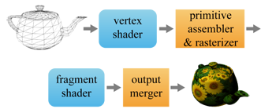
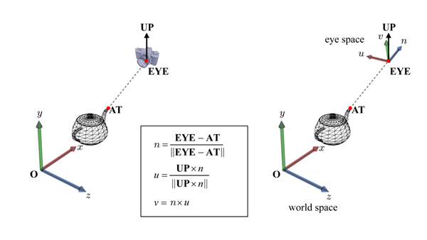
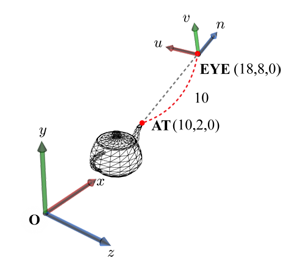
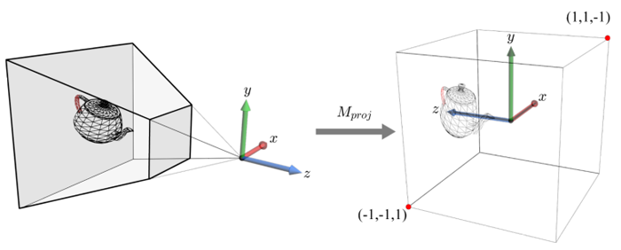
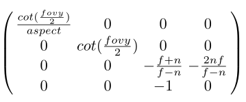
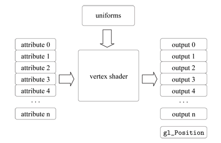

# Vertex Shader


The GPU rendering pipeline is split into **programmable** stages (vertex and fragment shaders) and **hard-wired** stages ("primitive assembler & rasterizer" and "output merger").

**Figure: Stages of the GPU rendering pipeline**



You have to provide programs for the vertex and fragment shaders. Without them, OpenGL&reg; ES cannot draw anything. The vertex shader operates on every vertex stored in the vertex array and performs various operations. The essential among them is applying a series of **transforms** to the vertices.

**Figure: Spaces and transforms for vertex shader**


## Object Space, World Space, and World Transform

Whereas the coordinate system used for creating an object is named **object space**, the virtual world containing all required objects is associated with the **world space**. The size, position, and orientation of an object in the world space are determined by what is called **world transform**. (OpenGL&reg; ES calls this **model transform**.) Its main components are scaling, translation, and rotation. A distinct object has its own world transform. The following figure shows a world-transform example.

In the world space, many objects can exist. Among them, consider a teapot. In this example, its world transform is the combination of "rotation about the Y axis by 90 degrees" and "translation along the X axis by 7 units".

**Figure: Transformation of a teapot object**


## View Space and View Transform

To capture the world, a virtual eye or camera is defined in the world space with 3 parameters:

- **EYE**: eye position
- **AT**: reference point which the eye looks at
- **UP**: view up vector describing where the top of the eye points

The following figure shows how to create a new space, `{EYE, u, v, n}`, called **view space**.

**Figure: Computing the view space**



There are 2 coordinate systems, world space and view space. Note that a point is given different coordinates in different spaces. Suppose that, as shown in the following figure, **AT** is located at the teapot's mouth end (10,2,0) and **EYE** is at (18,8,0). Then, the teapot's mouth end has the view-space coordinates (0,0,-10) whereas its world-space coordinates are (10,2,0).

The red dot is on the end of the teapot's mouth. It has been taken as **AT** and so its u and v coordinates are 0. If **EYE** is located at (18,8,0), the distance between **EYE** and **AT** is 10 and so the red dot's n coordinate is -10.

**Figure: Different coordinates in different spaces**



It becomes much easier to develop the rendering algorithms if all the world-space objects are newly defined in terms of the view space in the manner of the teapot's mouth end. This is done by the **view transform**, which is defined as a translation followed by a rotation. The following view matrix applies to all objects in the world space.

**Figure: View matrix**


## View Frustum and Projection Transform

Because the world space is no longer needed, denote the basis of the view space by `{x, y, z}` instead of `{u, v, n}` simply because `{x, y, z}` is more familiar. In the view space, define how much of the space to see. For this, give 4 parameters:

- `fovy` which stands for the field of view along the Y axis
- `aspect` for the field of view's aspect ratio
- `n` for the distance from **EYE** to the 'near clipping plane'
- `f` for the distance from **EYE** to the 'far clipping plane'

This set of 4 parameters defines a truncated pyramid whose apex is located at **EYE**, as shown in the following figure. It is called **view frustum**.

**Figure: View frustum**


In the figure above, the teapot intersects the view frustum. The part of the teapot outside the view frustum needs to be **clipped** so that only the remaining is processed for display. Transform the view frustum to an axis-aligned box, and the transform is applied to all vertices in the view space, performing clipping with respect to the box. The transform is called projection transform. The following figure shows the result of the **projection transform**. The box has the dimension of 23 and its center is located at the origin. The clip space is assumed to be a left-hand coordinate system by convention.

**Figure: Projection transform Mproj from the view space to the clip space**



The projection matrix is defined using the view frustum parameters, `fovy`, `aspect`, `n`, and `f`, as shown in the following figure.

**Figure: Projection matrix**



## Vertex Shader Input and Output

The vertex shader runs for each vertex of the polygon mesh. Its main inputs are attributes and uniforms:

- Attributes: Per-vertex data provided in a vertex array
- Uniforms: Read-only values, such as the transform matrix, to be uniformly applied to the vertices

**Figure: Input and output of the vertex shader**



The following code shows an example vertex shader. The shader language is C-like but provides specialized types. For example, `mat4` is a 4x4 matrix and `vec3` is a 3D vector. The following vertex shader example has 5 input values: `viewProjMat` and `worldMat` are 'uniforms' described by the keyword uniform, whereas `position`, `normal`, and `texCoord` are 'attributes' described by the keyword attribute.

```
uniform mat4 viewProjMat; /* 4x4 matrix for view + projection transforms */
uniform mat4 worldMat; /* 4x4 matrix for world transform */

attribute vec3 position;
attribute vec3 normal;
attribute vec2 texCoord;

varying vec3 v_normal;
varying vec2 v_texCoord;

void
main()
{
    gl_Position = viewProjMat * worldMat * vec4(position, 1.0);
    v_normal = mat3(worldMat) * normal;
    v_texCoord = texCoord;
}
```

The output of the vertex shader must include the built-in variable, `gl_Position`, which stores the **clip-space** vertex position. This is the only required output of the vertex shader. Optional output variables are described with the keyword `varying`. The output usually includes vertex normal and texture coordinates. In the above example, the object-space vertex normal is transformed to the world space and output to `v_normal`. On the other hand, the texture coordinates, `texCoord`, is simply copied to `v_texCoord`.

## Shader and Program Objects

Using a vertex or fragment shader stored in a file, create a **shader object**:

1. Load its source code into the OpenGL&reg; ES program.
2. Create a new shader object using the `glCreateShader()` function, which takes either the `GL_VERTEX_SHADER` or `GL_FRAGMENT_SHADER` attribute and returns the ID of the shader object.
3. Store the source code into the shader object using the `glShaderSource()` function with the vertex or fragment shader's source code and the shader object ID.
4. Compile the shader object using the `glCompileShader()` function.

Using the shader objects, create the **program object**:

1. Use the `glCreateProgram()` function, which takes no parameters and simply returns the ID of a new program object.
2. Give the shader and program object IDs to the `glAttachShader()` function, which attaches the shader object to the program object.
3. Link the program object using the `glLinkProgram()` function.
4. Invoke the `glUseProgram()` function to use the program object for rendering.

## Uniforms and Attributes in OpenGL&reg; ES

Consider a dynamic environment, where the scene objects continuously move. In the example vertex shader, worldMat must be updated per frame. On the other hand, `viewProjMat` must be updated if the eye moves. The OpenGL&reg; ES program must update and provide them for the vertex shader. For this purpose, first find the uniform locations that have been determined during the link phase. Given a uniform name in the shader, the `glGetUniformLocation()` function returns its location (denoted by an integer) in the program.

```
/* mProgram denotes the program object */
GLint mWHandle = glGetUniformLocation(mProgram, "worldMat")
```

Then, use the `glUniformMatrix4fv()` function to load the uniform with the updated `matrix`, `worldMat`. A list of functions for loading various uniforms is available and is collectively named `glUniformXXX()`, representing a set of variations including the `glUniform3f()` and `glUniformMatrix4x3fv()` functions.

Next, consider the attributes.

The vertex and index arrays for a polygon mesh are stored in the CPU memory, which is often called **client memory**. For rendering a mesh, make a **drawcall**. For every drawcall, the arrays have to be 'copied' from the client memory to the GPU memory.

Instead of resending the arrays every time a mesh is drawn, a more efficient way is to cache the data in the GPU memory. The arrays are transferred only once, and the rendering is done from the GPU memory cache. To achieve this, use **vertex buffer objects** (VBO).

There are 2 types of buffer objects in OpenGL&reg; ES:

- **Array buffer object** represents the vertex array and is specified by `GL_ARRAY_BUFFER`.
- **Element array buffer object** represents the index array and is specified by `GL_ELEMENT_ARRAY_BUFFER`.

To create and bind VBOs:

1. Use the `glGenBuffers()` function to ask for `n` buffer objects and receive them in buffers. In general, `n` is 2: one for vertices and the other for indices.
2. Use the `glBindBuffer()` function, where the first parameter is either `GL_ARRAY_BUFFER` or `GL_ELEMENT_ARRAY_BUFFER`. This specifies what the buffer is used for. The `glBindBuffer()` function call creates a VBO.
3. The buffer object is filled with data using the `glBufferData()` function, where the first parameter is either `GL_ARRAY_BUFFER` or `GL_ELEMENT_ARRAY_BUFFER` and the third parameter points to the vertex or index array.

The OpenGL&reg; ES program shown in the following example creates 2 VBOs:

```
glGenBuffers(2, &VBO);
glBindBuffer(GL_ARRAY_BUFFER, /* Target */
             VBO[0]); /* Buffer */
glBufferData(GL_ARRAY_BUFFER, /* Target */
             sizeof(vertices), /* Size */
             vertices, /* Data */
             GL_STATIC_DRAW); /* Usage */

glBindBuffer(GL_ELEMENT_ARRAY_BUFFER, VBO[1]);
glBufferData(GL_ELEMENT_ARRAY_BUFFER, sizeof(indices),
             indices, GL_STATIC_DRAW));
```

The vertex array is often described as an "array of structures", where a structure contains a set of attributes: position, normal, and texCoord in the example shader.

**Figure: Array of vertex structures**


Such a structure must be presented to the shader. For this purpose, the OpenGL&reg; ES program first invokes the `glEnableVertexAttribArray()` function to enable each parameter. After that, the `glVertexAttribPointer()` function is called. In this function, the first parameter denotes the parameter index, the second specifies the number (1, 2, 3, or 4) of components per parameter, fifth specifies the byte distance between the consecutive parameters of the same kind, and the sixth points to the first occurrence of the parameter in bytes. The OpenGL&reg; ES program shown in the following example details `position`, `normal`, and `texCoord` parameters.

```
int stride = sizeof(VertexStruct); /* VertexStruct with 3 attributes */
int offset = 0;

/* Position attribute */
glEnableVertexAttribArray(0); /* Position index = 0 */
glVertexAttribPointer(0, /* Index */
                      3, /* Size */
                      GL_FLOAT, /* Type */
                      GL_FALSE, stride, (GLvoid*)offset);

offset += sizeof(vec3); /* For accessing normal */
glEnableVertexAttribArray(1); /* Normal index = 1 */
glVertexAttribPointer(1, 3, GL_FLOAT, GL_FALSE, stride, (GLvoid*)offset);

offset += sizeof(vec3); /* For accessing texCoord */
glEnableVertexAttribArray(2); /* texCoord index = 2 */
glVertexAttribPointer(2, 2, GL_FLOAT, GL_FALSE, stride, (GLvoid*)offset);
```

## Drawcalls

All parameters and uniforms are now available. If you have a good fragment shader, you can draw a polygon mesh. For rendering a polygon mesh, you can make a drawcall. There are 2 options:

- `glDrawArrays()` for non-indexed mesh representation
- `glDrawElements()` for indexed mesh representation

Assuming that you have only the vertex array for the low-resolution sphere, the `glDrawArrays()` function is invoked. In the following example, the first parameter specifies what kind of primitives to render. Valid values include, for example, `GL_POINTS`, GL_LINES, GL_TRIANGLES, and GL_TRIANGLE_FAN. The second parameter specifies the starting index "in the vertex array". The last parameter specifies the number of vertices to be drawn.

```
glDrawArrays(GL_TRIANGLES, /* Mode */
             0, /* First */
             144); /* Count */
```

When you have both the vertex array and index array, the `glDrawElements()` function is invoked. The first parameter is the same as in the `glDrawArrays()` function. The second parameter specifies the number of elements "in the index array". The third parameter specifies the type of the values in the indices. It must be `GL_UNSIGNED_BYTE` or `GL_UNSIGNED_SHORT`. The last parameter points to the offset in bytes into the storage allocated by the `glBufferData()` function.

```
glDrawElements(GL_TRIANGLES, /* Mode */
               144, /* Count */
               GL_UNSIGNED_SHORT, /* Type */
               0); /* Indices */
```

## GLView Example

The following example code presents how to use OpenGL&reg; ES APIs in the callbacks of the GLView. In the `init_glview()` callback function, compile and link the shaders, and create VBOs.

```
/* OpenGL&reg; ES initialization callback */
static void
init_glview(Evas_Object *glview)
{
    /* Set OpenGL&reg; ES state color to black */
    glClearColor(0.0f, 0.0f, 0.0f, 1.0f);

    appdata_s *ad = (appdata_s *)evas_object_data_get(glview, "ad");

    if (!ad->initialized) {
        init_shader_program(ad); /* Compile and link shader */
        create_vbo(ad); /* Create vertex buffer object */
        ad->texture = create_texture(ad->win, "tizen_noalpha.png");

        glEnable(GL_DEPTH_TEST);
        ad->initialized = EINA_TRUE;
    }

    /* Initialize application variables */
}

static void
init_shader_program(appdata_s *ad)
{
    const char *p;

    p = vertex_tex_shader;
    ad->vtx_shader = glCreateShader(GL_VERTEX_SHADER);
    glShaderSource(ad->vtx_shader, 1, &p, NULL);
    glCompileShader(ad->vtx_shader);

    p = fragment_tex_shader;
    ad->fgmt_shader = glCreateShader(GL_FRAGMENT_SHADER);
    glShaderSource(ad->fgmt_shader, 1, &p, NULL);
    glCompileShader(ad->fgmt_shader);

    ad->program = glCreateProgram();
    glAttachShader(ad->program, ad->vtx_shader);
    glAttachShader(ad->program, ad->fgmt_shader);

    glLinkProgram(ad->program);

    ad->idx_a_position = glGetAttribLocation(ad->program, "a_position");
    ad->idx_a_tex = glGetAttribLocation(ad->program, "a_tex");

    ad->idx_wvp = glGetUniformLocation(ad->program, "u_wvpMatrix");
    ad->idx_tex = glGetUniformLocation(ad->program, "u_texSampler");

    glUseProgram(ad->program);
}

static void
create_vbo(appdata_s *ad)
{
    glGenBuffers(1, &ad->vbo_vertex);
    glGenBuffers(1, &ad->vbo_color);
    glGenBuffers(1, &ad->vbo_texture);

    glBindBuffer(GL_ARRAY_BUFFER, ad->vbo_vertex);
    glBufferData(GL_ARRAY_BUFFER, sizeof(cube_vertices), cube_vertices,
                 GL_STATIC_DRAW);
    glVertexAttribPointer(ad->idx_a_position, 3, GL_FLOAT, GL_FALSE,
                          3 * sizeof(float), 0);

    glBindBuffer(GL_ARRAY_BUFFER, ad->vbo_texture);
    glBufferData(GL_ARRAY_BUFFER, sizeof(cube_texs), cube_texs,
                 GL_STATIC_DRAW);
    glVertexAttribPointer(ad->idx_a_tex, 2, GL_FLOAT, GL_FALSE,
                          2 * sizeof(float), 0);

    glEnableVertexAttribArray(ad->idx_a_position);
    glEnableVertexAttribArray(ad->idx_a_tex);

    glGenBuffers(1, &ad->vbo_index);
    glBindBuffer(GL_ELEMENT_ARRAY_BUFFER, ad->vbo_index);
    glBufferData(GL_ELEMENT_ARRAY_BUFFER, sizeof(cube_indices),
                 cube_indices, GL_STATIC_DRAW);
}
```

In the `draw_glview()` callback, calculate the world, view, and projection matrices and then pass the combined matrix to the vertex shader through the `glUniformXXX()` function. When all uniforms are passed to the shader, the OpenGL&reg; ES drawcall is made.

```
/* OpenGL&reg; ES drawing callback */
static void
draw_glview(Evas_Object *glview)
{
    appdata_s *ad = (appdata_s *)evas_object_data_get(glview, "ad");
    float world[16], viewproj[16];
    float aspect;

    if (!ad)
        return;

    init_matrix(world);
    init_matrix(viewproj);

    aspect = (float) ad->glview_w / (float) ad->glview_h;

    /* View matrix is the identity matrix */
    view_set_perspective(viewproj, 60.0f, aspect, 1.0f, 20.0f);

    translate_xyz(world, 0.0f, 0.0f, -2.5f);
    rotate_xyz(world, ad->xangle, ad->yangle, 0.0f);

    multiply_matrix(ad->wvp, viewproj, world);

    glClear(GL_COLOR_BUFFER_BIT | GL_DEPTH_BUFFER_BIT);

    glUniformMatrix4fv(ad->idx_wvp, 1, GL_FALSE, ad->wvp);

    glBindTexture(GL_TEXTURE_2D, ad->texture);
    glActiveTexture(GL_TEXTURE0);
    glUniform1i(ad->idx_tex, 0);

    glDrawElements(GL_TRIANGLES, cube_indices_count, GL_UNSIGNED_SHORT, 0);

    glFlush();
}
```

## Related Information
- Dependencies
  - Tizen 2.4 and Higher for Mobile
  - Tizen 2.3.1 and Higher for Wearable
