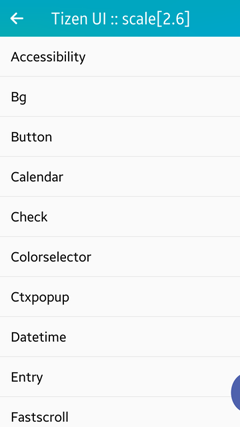
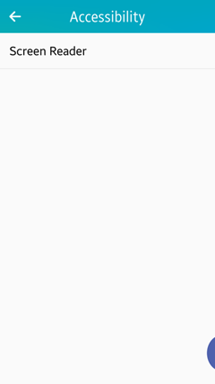
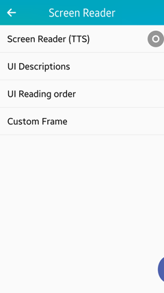
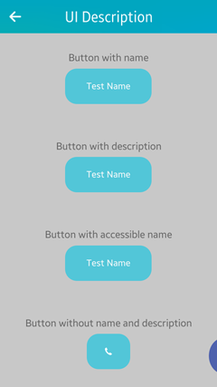
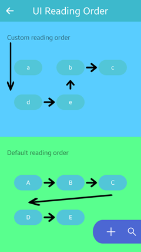
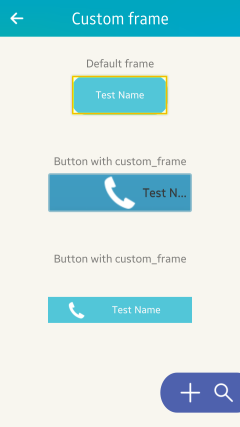
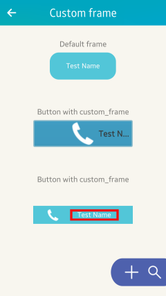

# Implementing Accessible Applications

When implementing an accessible application, follow the good accessibility practices. This topic uses an EFL Elementary sample application to demonstrate how you can implement accessibility features in your application.

## Good Practices for Implementing Accessibility

An accessible application requires the following features to be implemented:

- **Available definitions for the screen reader**

  - Names, roles, labels, and descriptions

    Components used in an application must have defined names, roles, and, when appropriate, descriptions. This allows the screen readers to present them to low-vision and visually-impaired users.

    In addition, the elements the user can interact with must have clear and concise text labels. For example, a button with an **X** icon and no label works for most users, but for someone using a screen reader the icon is invisible. It is better to use a button labeled **X** or **Cancel** instead of substituting the text for an icon.

  - Text equivalents for images, audio, and multimedia

    To a screen reader, any graphics on the screen, such as photos or videos, are invisible. Therefore, images and diagrams conveying important information must have text equivalents for users using screen readers. Such descriptions must briefly present all necessary information. For example, the text equivalent for a circle diagram presenting statistics showing that 20% of the population like product X can be "circle diagram: 20% of the population like X". Purely decorative images do not need text descriptions, such as "pretty blue background".

    Similarly, it is advised to add text equivalents or subtitles to audio or audio-video content for the benefit of deaf and hard of hearing users.

- **Clear and easily readable screen**

  - Adjustable font size

    An adjustable font size is one of the most basic accessibility features. Fonts can be adjusted system-wide or in the settings of a specific application. Providing this feature in your application is a good accessibility practice and can help many low-vision or elderly users.

    When implementing your application, leave some extra space in the labels to keep all their text visible when the user decides to set a larger font size. This extra room is also possibly needed when your application is translated into different languages.

  - Adjustable color themes

    Color themes are often considered rather a question of aesthetics than usability, but they play an important role in making software more accessible. Adding alternative color themes, such as a high-contrast or reversed-colors mode, can significantly improve the user experience for certain groups of visually-impaired users.

    If preparing a complete color theme is too much work, incorporate a basic background and text color changing feature to help users customize the application and adjust it to their needs and preferences.

  - Supplementing color coding

    Color coding must not be the only way of conveying information since some people are not able to distinguish between different colors. This does not only concern individuals with diagnosed color vision disabilities, as it is estimated that about 10% of the male population is color blind to some extent. Even contrasting color pairs can be an issue, such as the commonly used red and green.

    Color coding can and must be used, but it must always be supplemented by other means of conveying the same information, such as appropriate labels, graphics, or font formatting.

    For example, do not ask the user to "press the green button to confirm or the red button to reject" and supply 2 colored but otherwise identical buttons. Instead, add **Confirm** and **Reject** labels to the buttons. If you do not have enough room for that much text, use a symbolic label like **OK** and **X**.

  - Minimalism

    Overloading the screen with lots of elements is undesirable both in terms of accessibility and usability in general. Users with physical disabilities or poor vision can find it difficult to operate very small components, while those with developmental or attention disabilities can feel overwhelmed by a complex layout. Even non-disabled users can be confused by a component-packed screen and have difficulty navigating through it, especially when operating the device on the go or using only one hand.

  - No flickering or blinking content

    Flickering elements can trigger epileptic seizures. This most often occurs when the parts of the screen blink at a rate of about 20 Hz. Because flickering at any rate between about 5 and 60 Hz is potentially dangerous to users with photosensitive epilepsy, avoid flickering or blinking elements and animations altogether.

- **Easy navigation and user interactions**

  - Simple navigation flow

    The navigation flow within an application must be as simple and intuitive as possible. It must be predictable and take into account the most common tasks that are performed by the user. Additionally, users must be able to operate the application without learning many complex new gestures as both physically disabled and low-vision users can find it difficult to perform certain gestures.

  - Time responses

    When your content requires the user to respond in a limited amount of time, make this time window large enough. It is possible that less proficient or disabled users do not manage to respond quickly. A good practice is to add a response indicating that the user needs more time to perform the task or making the response time user-configurable.

## Creating an Accessible Application

You can use the mobile native [UI Components](https://developer.tizen.org/development/sample/native/UI/UI_Components) sample application provided within the Tizen Studio to see how the most important accessibility features are implemented in practice. The sample application contains an AT-SPI2 compliant screen reader, which you can use to test the accessibility features on a device. Enable the screen reader by running the sample application and selecting **Accessibility > Screen Reader > Screen Reader (TTS)**.

In the Tizen 2.4 release, the screen reader is available only inside the UI Components application. This means that when the UI Components application is terminated or paused and sent to the background, the screen reader is automatically disabled, and when the UI Components application is restored, the screen reader is enabled.

**Figure: UI Components sample application**

  

> **Note**  
> If reading of any arbitrary text directly from the application needs to be synchronized with the screen reader voice output, you must use the Tizen platform TTS API (in [mobile](../../../api/mobile/latest/group__CAPI__UIX__TTS__MODULE.html) and [wearable](../../../api/wearable/latest/group__CAPI__UIX__TTS__MODULE.html) applications), which is also used by the screen reader.

### Making UI Components Readable

Since the screen reader is a fundamental accessibility feature for low-vision and visually-impaired persons, making your application readable by the screen reader is a priority task. The following example shows how to make your application readable to the AT-SPI2 compliant screen reader.

The screen reader reads out information about the currently pointed or focused UI component. The UI component information is provided to the screen reader using the AT-SPI2 standard protocol and consists of the following information items:

- Label:

  The label on the component. For example, **Ok** or **Cancel** (for a button). The label maps to the `name` property of the AT-SPI2 object and is equivalent to the result of the `elm_object_text_get()` function. The property can be also overwritten using the `elm_atspi_accessible_name_set()` function.

- Traits:

  The component type or role. For example, `"Button"` (for a button). The trait maps to the `role` property of the AT-SPI2 object.

- State:

  The value or status of the component. For example, `"Disabled"` (for a disabled button).

- Description (optional attribute):

  A hint or guide to describe the component. For example, "This button closes your application" (for a button). The description maps to the `description` property of the AT-SPI2 object.

The screen reader reads the information in the following order when the user selects the button by using the 1-finger-tap gesture. The user also can select a button by using a 1-finger-touch-and-move gesture.

- **Ok** (Label) > "Button" (Traits) > "This button closes your application" (Description)
- **Cancel** (Label) > "Button" (Traits) > "Disabled" (State)

The following table lists the functions you can use to set EFL Elementary UI component information to be read by the screen reader, and to support internationalization (i18n) for the information.

**Table: Functions for making UI components readable**  

| Function                                 | Description                              |
|----------------------------------------|----------------------------------------|
| `void elm_atspi_accessible_name_set(Elm_Interface_Atspi_Accessible *obj, const char *text)` | Set a text of an object.<br><br>- `obj`: Elementary object<br>- `text`: New accessible name for the object |
| `void elm_atspi_accessible_name_cb_set(Elm_Interface_Atspi_Accessible *obj, Elm_Atspi_Reading_Info_Cb name_cb, const void *data)` | Set the accessible name information callback for an object.<br><br>- `obj`: Elementary object<br>- `name_cb`: Accessible name information callback for the object<br>- `data`: Data passed to the accessible name information callback |
| `void elm_atspi_accessible_role_set(Elm_Interface_Atspi_Accessible *obj, Elm_Atspi_Role role)` | Set the accessible role.<br><br>- `obj`: Elementary object<br>- `role`: New accessible role for the object |
| `void elm_atspi_accessible_description_set(Elm_Interface_Atspi_Accessible *obj, const char *text)` | Set the accessible description.<br><br>- `obj`: Elementary object<br>- `text`: Description text for the object |
| `void elm_atspi_accessible_description_cb_set(Elm_Interface_Atspi_Accessible *obj, Elm_Atspi_Reading_Info_Cb description_cb, const void *data)` | Set the accessible description information callback for an object.<br><br>- `obj`: Elementary object<br>- `description_cb`: Accessible description information callback for the object<br>- `data`: Data passed to the accessible description information callback |
| `void elm_atspi_accessible_translation_domain_set(Elm_Interface_Atspi_Accessible *obj, const char *domain)` | Bind the translation domain to the accessible object.<br><br>- `obj`: Elementary object<br>- `domain`: Translation domain (name space for translation keys) |


**Figure: Readable components in the UI Components sample**

  

The Elementary library sets the default information (label, traits, state) for the components, except for an icon and image. You can override the default information in various ways:

- Button with a custom name  

  Use the `elm_object_text_set()` function to define a custom name.

  ```
  /* File: src/accessibility/screen_reader/description.c */

  btn = elm_button_add(layout);
  elm_object_text_set(btn, "Test Name");
  ```

  If the user highlights the button, the screen reader says "Test Name, button" (it reads out the component custom name and default trait).

- Button without a name and description

  If you define a button with an icon image only, no name or description is provided by default.

  ```
  /* File: src/accessibility/screen_reader/description.c */

  btn = elm_button_add(layout);
  img = elm_image_add(btn);
  elm_image_file_set(img, IMG_PATH, NULL);
  elm_object_part_content_set(btn, "icon", img);
  ```

  If the user highlights the button, the screen reader says "button" (it reads out the component default trait only).

- Button with an internationalized description  

  Use the `elm_atspi_accessible_description_set()` function to define a description. To make multiple language versions available define the actual description strings in PO files and use the `elm_atspi_accessible_translation_domain_set()` function to bind the translation domain to the component.

  ```
  /* File: CMakeLists.txt */

  # i18n
  ADD_SUBDIRECTORY(po)

  /* File: packaging/ui-controls.spec */

  BuildRequires:  gettext-tools

  /opt/usr/apps/org.tizen.ui-controls/res/locale/<any language, use asterisk>/LC_MESSAGES/<any file, use asterisk>

  /* File: po/CMakeLists.txt */

  SET(POFILES en_US.po it_IT.po)
  SET(MSGFMT "/usr/bin/msgfmt")

  FOREACH(pofile ${POFILES})
      SET(pofile ${CMAKE_CURRENT_SOURCE_DIR}/${pofile})
      MESSAGE(PO: "  ${pofile}")
      GET_FILENAME_COMPONENT(absPofile ${pofile} ABSOLUTE)
      GET_FILENAME_COMPONENT(lang ${absPofile} NAME_WE)
      SET(moFile ${CMAKE_CURRENT_BINARY_DIR}/${lang}.mo)
      ADD_CUSTOM_COMMAND(
          OUTPUT ${moFile}
          COMMAND ${MSGFMT} -o ${moFile} ${absPofile}
          DEPENDS ${absPofile})
      INSTALL(FILES ${moFile}
          DESTINATION ${LOCALEDIR}/${lang}/LC_MESSAGES RENAME ${PACKAGE}.mo)
      SET(moFiles ${moFiles} ${moFile})
  ENDFOREACH(pofile)

  ADD_CUSTOM_TARGET(po ALL DEPENDS ${moFiles})

  /* File: po/en_US.po */

  msgid "IDS_BUTTON_DESCRIPTION"
  msgstr "One finger double tap to activate"

  msgid "IDS_BUTTON_NAME"
  msgstr "Button accessibility name"

  /* File: po/it_IT.po */

  msgid "IDS_BUTTON_DESCRIPTION"
  msgstr "Un dito doppio tap per attivare"

  msgid "IDS_BUTTON_NAME"
  msgstr "Button nome di accessibilità"

  /* File: src/main.c */

  /* Bind package locale file */
  bindtextdomain(PACKAGE, LOCALE_DIR);
  textdomain(PACKAGE);

  /* File: src/accessibility/screen_reader/description.c */

  btn = elm_button_add(layout);
  elm_object_text_set(btn, "Test Name");
  elm_object_style_set(btn, "default");
  elm_object_part_content_set(layout, "button_description", btn);
  elm_atspi_accessible_description_set(btn, "IDS_BUTTON_DESCRIPTION");
  elm_atspi_accessible_translation_domain_set(btn, PACKAGE);
  ```

  If the user highlights the button and the display language is set to English (US), the screen reader says "Test Name, button, one finger double tap to activate" (it reads out the component custom name, default trait, and description from the `en_US.po` file). If the display language is changed, the description string from the relevant PO file is used.

- Button with an accessible name and an accessible description

  - Use the `elm_atspi_accessible_name_set()` function to define an accessible name.

    ```
    /* File: src/accessibility/screen_reader/description.c */

    btn = elm_button_add(layout);
    elm_object_text_set(btn, "Test Name");
    elm_object_style_set(btn, "default");
    elm_object_part_content_set(layout, "button_a11y_name", btn);
    elm_atspi_accessible_name_set(btn, "IDS_BUTTON_NAME");
    elm_atspi_accessible_translation_domain_set(btn, PACKAGE);
    ```

    If the user highlights the button, the screen reader says "Button accessibility name, button" (it reads out the component accessible name from the `en_US.po` file and the default trait). If the display language is changed, the accessible name string from the relevant PO file is used.

    The `elm_atspi_accessible_name_set()` function overrides the custom name set earlier with the `elm_object_text_set()` function.

  - You can also use the `elm_atspi_accessible_name_cb_set()` and `elm_atspi_accessible_description_cb_set()` functions to define callbacks that return an accessible name and description for the button.

    ```
    static char*
    _accessible_name_cb(void *data, Evas_Object *obj)
    {
        return strdup("Accessible Name");
    }
    static char*
    _accessible_description_cb(void *data, Evas_Object *obj)
    {
        return strdup("Accessible Description");
    }

    btn = elm_button_add(layout);
    elm_object_text_set(btn, "Test Name");
    elm_atspi_accessible_name_cb_set(btn, _accessible_name_cb, NULL);
    elm_atspi_accessible_description_cb_set(btn, _accessible_description_cb, NULL);
    ```

    If the user highlights the button, the screen reader says "Accessible Name, button, Accessible Description".

You can also create a custom reading of multi-style components. Sometimes, it is necessary to have different voice output depending on the style assigned to the UI component. The `default` style is handled "out of the box" by the accessibility framework, but you must handle any alternative styles on the application side. The Elementary checkbox component offers a good example of alternative styles:
- `default` style in a checkbox:The reading must be "<label>, <state>", where <label> is a text assigned to the checkbox and <state> is read as "selected" or "not selected", depending on the checkbox state.
- `favorite` style in a checkbox:The reading must be "Favorite button, <state>", where <state> is read as "selected" or "not selected", depending on the checkbox state.
- `on&off` style in a checkbox:The reading must be "On/off button, <state>", where <state> is read as "on" or "off", depending on the checkbox state.

The following source code snippet demonstrates how to handle the `favorite` and `on&off` checkbox styles in the application source code:

```
/* File: src/check.c */

check = elm_check_add(box);
elm_object_style_set(check, "favorite");
elm_atspi_accessible_name_set(check, "Favorite button");

check = elm_check_add(box);
elm_object_style_set(check, "on&off");
elm_atspi_accessible_role_set(check, ELM_ATSPI_ROLE_TOGGLE_BUTTON);
elm_atspi_accessible_name_set(check, "On, off");
```
### Setting the UI Reading Information Types

By default, the screen reader uses all accessible information types for an Elementary object, such as label (name), traits, and state. To limit the information types to be used, you can define a list of reading information types.

The following table lists the function you can use to define the reading information types for an object.

**Table: Function for setting the reading information types**

| Function                                 | Description                              |
|----------------------------------------|----------------------------------------|
| `void elm_atspi_accessible_reading_info_type_set(Elm_Interface_Atspi_Accessible *obj, Elm_Atspi_Reading_Info_Type_Mask reading_info)` | Set the reading information types for an accessible object.<br><br>- `obj`: Elementary object<br>- `reading_info`: Reading information types |

The following source code snippet demonstrates how to set the reading information types for an accessible object in the application source code:

```
static char*
_accessible_name_cb(void *data, Evas_Object *obj)
{
    return strdup("Accessible Name");
}
static char*
_accessible_description_cb(void *data, Evas_Object *obj)
{
    return strdup("Accessible Description");
}

btn = elm_button_add(layout);
elm_object_text_set(btn, "Test Name");
elm_atspi_accessible_name_cb_set(btn, _accessible_name_cb, NULL);
elm_atspi_accessible_description_cb_set(btn, _accessible_description_cb, NULL);
elm_atspi_accessible_reading_info_type_set(btn, (ELM_ACCESSIBLE_READING_INFO_TYPE_NAME |
                                                 ELM_ACCESSIBLE_READING_INFO_TYPE_DESCRIPTION));
```

If the user highlights the button, the screen reader says "Accessible Name, Accessible Description", which corresponds to the selected `ELM_ACCESSIBLE_READING_INFO_TYPE_NAME` and `ELM_ACCESSIBLE_READING_INFO_TYPE_DESCRIPTION` reading information types. It does not read the `ELM_ACCESSIBLE_READING_INFO_TYPE_TRAITS` type reading information, which in this case is "button".

### Setting the UI Reading Order

The following table lists the functions you can use to customize the order in which the screen reader covers the UI components on the screen.

**Table: Functions for setting the reading order**

| Function                                 | Description                              |
|----------------------------------------|----------------------------------------|
| `Eina_Bool elm_atspi_accessible_relationship_append(Elm_Interface_Atspi_Accessible *obj, Elm_Atspi_Relation_Type type, const Elm_Interface_Atspi_Accessible *relation_object)` | Append the relation to the relation set of a certain object or component object.<br><br>-		`obj`: Elementary accessible object (relation source)<br>-	`type`: Type of the ATSPI relation<br>-		`relation_object`: Relation target object |
| `void elm_atspi_accessible_relationship_remove(Elm_Interface_Atspi_Accessible *obj, Elm_Atspi_Relation_Type type, const Elm_Interface_Atspi_Accessible *relation_object)` | Remove the relation from the relation set of a certain object or component object.<br><br>-			`obj`: Elementary accessible object (relation source)<br>-		`type`: Type of the ATSPI relation<br>-	`relation_object`: Relation target object |

The following figure illustrates the UI reading order example in the UI Components sample application. In the top part of the screen, the components have been ordered explicitly by the developer by setting the ATSPI standard relations between accessible objects corresponding to these components. In the bottom part of the screen, the components have no relation-based navigation set at all. This results in the natural reading order of the UI elements maintained implicitly by the screen reader itself. The natural reading order is a heuristic based on the UI elements' geometrical position on the screen (top to bottom, and left to right reading direction).

**Figure: UI reading order in the UI Components sample**



The following code illustrates how the customized reading order for the top part of the screen has been implemented. The component relations are defined with `ATSPI_RELATION_FLOWS_TO` and `ATSPI_RELATION_FLOWS_FROM` parameters. In addition to the normal relations used when navigating forward, inverse relations are defined as well to ensure proper behavior when navigating backward.

You can have various independent relation-based navigation chains on one screen. Each relation-based navigation chain is resolved locally and has priority over the default navigation order maintained by the screen reader. When one of the ends of a relation-based navigation chain is reached, the highlight frame goes forward along to the actual navigation direction to the closest component in the default navigation order. It omits interim components of the relation-based navigation chains. In this example, when the navigation command "next" is called from the **c** button, the highlight frame goes from the **c** button to the **Default reading order** label.

```
/* File: src/accessibility/screen_reader/reading_order.c */

Evas_Object *btnA;
Evas_Object *btnB;
Evas_Object *btnC;
Evas_Object *btnD;
Evas_Object *btnE;
Evas_Object *labelCustom;

/* Creating buttons with custom order */
btnA = elm_button_add(layout);
elm_object_text_set(btnA, "a");

/*
   Inform the assistive technology that UI information
   must be presented in following order (btnA is by-passed)
*/
elm_atspi_accessible_relationship_append(labelCustom, ELM_ATSPI_RELATION_FLOWS_TO, btnD);
elm_atspi_accessible_relationship_append(btnD, ELM_ATSPI_RELATION_FLOWS_TO, btnE);
elm_atspi_accessible_relationship_append(btnE, ELM_ATSPI_RELATION_FLOWS_TO, btnB);
elm_atspi_accessible_relationship_append(btnB, ELM_ATSPI_RELATION_FLOWS_TO, btnC);

/* Inverse relations */
elm_atspi_accessible_relationship_append(btnC, ELM_ATSPI_RELATION_FLOWS_FROM, btnB);
elm_atspi_accessible_relationship_append(btnB, ELM_ATSPI_RELATION_FLOWS_FROM, btnE);
elm_atspi_accessible_relationship_append(btnE, ELM_ATSPI_RELATION_FLOWS_FROM, btnD);
elm_atspi_accessible_relationship_append(btnD, ELM_ATSPI_RELATION_FLOWS_FROM, labelCustom);
```

Navigation relations can also be used to exclude some components from the sequential navigation (for example, they are not reachable using the "next" or "previous" navigation commands triggered on 1-finger flicks). In the example, the **a** button was by-passed by setting a navigation relation between the **Custom reading order** label and the **d** button. However, the **a** button can still be reached by direct navigation (1-finger single tap or 1-finger hover). To entirely exclude the component from navigation (including direct navigation), set the `ATSPI_ROLE_REDUNDANT_OBJECT` role for the component using the `elm_atspi_accessible_role_set()` function.

### Customizing the Highlight Frame

The accessibility framework provides a highlight frame around the currently selected or focused UI component, and you can customize its size, shape, and color. The following code snippets demonstrate how to adjust the style of the highlight frame from the default yellow style (left in the figure) to  a custom red style (right in the figure).

**Figure: Highlight frame in the UI Components sample**

 

The following code snippets has been simplified to make the example clearer. Irrelevant code has been omitted, and long variables and resource names have been shortened to avoid line wrapping. The full version of the source code is available in the following files:

- `CMakeLists.txt`
- `edc_resource/accessibility/screen_reader/custom_frame.edc`
- `edc_resource/default/inc/my_button_header.edc`
- `edc_resource/default/my_button.edc`
- `inc/main.h`
- `res/images/btn_style_nor.png`
- `res/images/btn_style_sel.png`
- `res/images/core_dropdown_label_icon_arrow.png`
- `res/images/custom_highlight.png`
- `res/images/custom_highlight2.png`
- `res/ui-controls.edc`
- `src/accessibility/screen_reader.c`
- `src/accessibility/screen_reader/custom_frame.c`

In the `edc_resource/default/my_button.edc` file, define the custom style for the component. In this example, the highlight frame for the button is changed.

1. Mark that the component can render the accessibility highlight frame by setting value of the `access_highlight` property to `on`.
2. Register the `c_h_2.png` graphical resource, which contains the custom frame image.
3. Define a new `highlight` part with 2 states: `default` and `visible`. In the `default` state, use the resource registered in the previous step to set the value of the `image.normal` property.
4. Program both states to show or hide the accessibility highlight frame on signals:
   - `elm,action,access_highlight,show`
   - `elm,action,access_highlight,hide`

```
group {
   name: "elm/button/base/custom2";

   data.item: "access_highlight" "on";
   images.image: "../../res/images/c_h_2.png" COMP;

   parts {
      part {
         name: "highlight";
         clip_to: "highlight_clip";
         description {
            state: "default" 0.0;
            image.normal: "../../res/images/c_h_2.png";
            image.border: 10 10 10 10;
            image.middle: 0;
            fill.smooth: 0;
            rel1.to: "elm.text";
            rel1.offset: 30 5;
            rel2.to: "elm.text";
            rel2.offset: -30 0;
            visible: 0;
         }
         description {
            state: "visible" 0.0;
            inherit: "default" 0.0;
            visible: 1;
         }
      }
   }
   programs {
      program {
         name: "show_new_highlight";
         signal: "elm,action,access_highlight,show";
         source: "elm";
         action: STATE_SET "visible" 0.0;
         target: "highlight";
      }
      program {
         name: "hide_new_highlight";
         signal: "elm,action,access_highlight,hide";
         source: "elm";
         action: STATE_SET "default" 0.0;
         target: "highlight";
      }
   }
}
```

In the `src/accessibility/screen_reader/custom_frame.c` file, assign the style defined above to the button component using the `elm_object_style_set()` function, where the second parameter is the last segment of the `elm/button/base/custom2` group name defined in the EDC file.

```
static Evas_Object*
create_custom_frame(Evas_Object *parent)
{
    Evas_Object *btn;
    Evas_Object *layout;

    layout = elm_layout_add(parent);

    btn = elm_button_add(layout);

    elm_object_style_set(btn, "custom2");

    return layout;
}
```

## Related Information
- Dependencies
  - Tizen 2.4 and Higher for Mobile
  - Tizen 3.0 and Higher for Wearable
