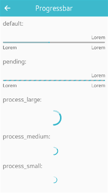

# Progressbar

The progressbar UI component displays the progress status of a given job. For more information, see the [Progressbar](../../../../api/mobile/latest/group__Elm__Progressbar.html) API.

This feature is supported in mobile applications only.

## Basic Usage

To use a progressbar component in your application:

1. Add a progressbar with the `elm_progressbar_add()` function:

   ```
   Evas_Object *progressbar;

   progressbar = elm_progressbar_add(parent);
   ```

2. Set a progressbar style:

   - Set a style to the progressbar with the `elm_object_style_set()` function. If you use the default style, you can skip this step.

     ```
     elm_object_style_set(progressbar, "pending");
     ```

   - Set a label to the progressbar with the `elm_object_text_set()` or `elm_object_part_text_set()` function:

     ```
     /* Default style (elm.text.top.right) */
     elm_object_text_set(progressbar, "text");

     elm_object_part_text_set(progressbar, "elm.text.bottom.left", "text");
     ```

3. Activate the progressbar:

   - Set the progressbar pulse mode to activate the progressbar with the `elm_progressbar_pulse_set()` function:

     ```
     elm_progressbar_pulse_set(progressbar, EINA_TRUE);
     ```

     The pulse mode makes the progressbar loop infinitely between the start and end position. If you activate the pulse mode in the default style, the unit is invisible.

   - Use the `elm_progressbar_pulse()` function to start the progressbar animation loop:

     ```
     elm_progressbar_pulse(progressbar, EINA_TRUE);
     ```

4. Register the [callback](#callbacks) functions.  

 The following example shows how to define and register a callback for the `changed` signal:

   ```
   evas_object_smart_callback_add(progressbar, "changed", changed_cb, data);

   void
   changed_cb(void *data, Evas_Object *obj, void *event_info)
   {
       dlog_print(DLOG_INFO, LOG_TAG, "The value has changed\n");
   }
   ```

The following example shows a simple use case of the progressbar component.

**Example: Progressbar use case**



```
Evas_Object *win;
Evas_Object *conf;
Evas_Object *nf;
Evas_Object *box;
Evas_Object *progressbar;

/* Starting right after the basic EFL UI layout code */
/* (win - conformant - naviframe) */

/* Add a box to contain the progressbar and push the box into the naviframe */
box = elm_box_add(nf);
evas_object_show(box);
elm_naviframe_item_push(nf, "Progressbar", NULL, NULL, box, NULL);

/* Add a progressbar and set a "default" style */
progressbar = elm_progressbar_add(box);

/* Set the progressbar alignment. The progressbar fills whole parent area */
evas_object_size_hint_align_set(progressbar, EVAS_HINT_FILL, EVAS_HINT_FILL);
/* Set the progressbar weight size. The progressbar takes up all the space in its parent */
evas_object_size_hint_weight_set(progressbar, EVAS_HINT_EXPAND, EVAS_HINT_EXPAND);

/* Set the progressbar format */
elm_progressbar_unit_format_set(progressbar, "%1.2f%%");

/* Set the progressbar value */
elm_progressbar_value_set(progressbar, 0.6);

/* Set a text to the progressbar */
elm_object_text_set(progressbar, "progressbar");

evas_object_show(progressbar);
elm_box_pack_end(box, progressbar);
```

## Features

To configure the progressbar features:

- Use the progressbar value:

  - Change the value with the `elm_progressbar_value_set()` function. The progressbar emits the `changed` signal when the progress value changes. In the following example, the progressbar value is set to 20%.

    ```
    /* Supported style: default */
    elm_progressbar_value_set(progressbar, 0.2);
    ```

  - Read the current value:

    ```
    double value = elm_progressbar_value_get(progressbar);
    ```

- Set a text in the progressbar:

  - Set a label to the progressbar with the `elm_object_text_set()` function, if the style supports a text part.
  ```
  /* Supported styles: default, pending */elm_object_text_set(progressbar, "progressbar");
  ```

  - According to the [style](#styles), the `elm_object_part_text_set()` function is used in order to do the setting in the other location.  
  `elm_object_part_text_set(progressbar, "elm.text.bottom.left", "progressbar");`

  - Set the unit label with the `elm_progressbar_unit_format_set()` function.

    To set the unit label to be a float number with 2 decimals:

    ```
    elm_progressbar_unit_format_set(progressbar, "%1.2f%%");
    ```

    If you set the `elm.text.bottom.right` text part, you cannot use a unit label. You can choose 1 unit label or the bottom-right label. The default unit label format is `%.0f%%`.

- Invert the progressbar.

  In the inverted mode the high values are on the left and the low values on the right.

  ```
  /* Supported style: default */
  elm_progressbar_inverted_set(progressbar, EINA_TRUE);
  ```

## Styles

The following table lists the available component styles.

**Table: Progressbar styles**

| Style                                    | Sample                                   | Text part                                |
|----------------------------------------|----------------------------------------|----------------------------------------|
| `elm/progressbar/horizontal/default`     |  | `elm.text.top.right`<br>`(default)`<br>`elm.text.bottom.left`<br>`elm.text.bottom.right` |
| `elm/progressbar/horizontal/pending`     |  | `elm.text.top.right`<br> `(default)`<br>`elm.text.bottom.left`<br>`elm.text.bottom.right` |
| `elm/progressbar/horizontal/process_large`<br>`elm/progressbar/horizontal/process_medium`<br>`elm/progressbar/horizontal/process_small` |  | N/A                                      |

## Callbacks

You can register callback functions connected to the following signals for a progressbar object.

**Table: Progressbar callback signals**

| Signal    | Description                    | `event_info` |
|---------|------------------------------|------------|
| `changed` | The progressbar value changes. | `NULL`       |

> **Note**  
> The signal list in the API reference can be more extensive, but only the above signals are actually supported in Tizen.

> **Note**  
> Except as noted, this content is licensed under [LGPLv2.1+](http://opensource.org/licenses/LGPL-2.1).

## Related Information
- Dependencies
  - Tizen 2.4 and Higher for Mobile
