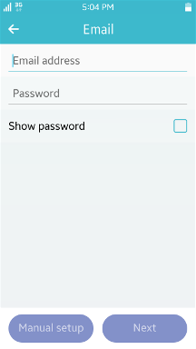

# Getting Started with EFL UI Programming

This topic explains how to start EFL UI programming. If you first want to learn what EFL is and how it works, see [Introduction](./index.md). If you want to create a first application step by step, see [Creating Your First Tizen Mobile Native Application](../../../getting-started/mobile/first-app.md) or [Creating Your First Tizen Wearable Native Application](../../../getting-started/wearable/first-app.md).

## Running EFL Applications

The first thing you need to do for EFL UI programming is to set the application to a basic condition, in which you can use EFL libraries and run the application life-cycle. In Tizen, managing the application life-cycle is supported by the [Application framework](../../app-management/applications.md), and it handles the basic steps of running EFL as well. It enables you to configure application properties, and manage application data, runtime environment, and behavior.

The following code snippet shows what the EFL UI application looks like in Tizen:

```
#include <app.h>
#include <Elementary.h>

static bool
app_create(void *data)
{
    /* Here comes your application code */
}

int
main(int argc, char *argv[])
{
    event_callback.create = app_create;
    ret = ui_app_main(argc, argv, &event_callback, &ad);

    return ret;
}
```

In the above code, a header file (`Elementary.h`) is included. The Elementary library is a high-level wrapper of EFL, and you can use other EFL libraries, such as Evas, Ecore, and Edje, by including the Elementary header. The `ui_app_main()` function runs the application.

To run an Elementary application, you must initiate, run, and terminate the Elementary main loop. You cannot see the code in the template though, since it is hidden in a higher-layer library (application framework). The following code snippet shows the main function of a minimal Elementary application:

```
#include <Elementary.h>

int
main(int argc, char *argv[])
{
    elm_init(argc, argv);
    /* Here comes your application code */
    elm_run();
    elm_shutdown();

    return 0;
}
```

To use the Elementary library:

1. Initialize the Elementary library with the `elm_init()` function.
2. Start the Elementary main loop with the `elm_run()` function. The function does not return and constantly loops and runs the event and processing tasks.
3. When your application terminates, shut down the Elementary library with the `elm_shutdown()` function. The function frees the Elementary objects that were allocated in the main loop, so you do not need to separately deallocate them.

## Starting from a Window

EFL UI programming starts from adding a window. Basically, the way to build an EFL UI application is by adding a window and setting content in it.

The window is the bottommost UI component in an EFL application. Usually, when an application is launched, a window that fits into the device screen is created and shown.

**Figure: Empty window**


Windows are provided by the Elementary library. Since Elementary is a high-level wrapper on the topmost layer in the EFL hierarchy, you can start EFL UI programming with the Elementary library and expand the scope to lower-level libraries, as needed.

The following code snippet shows how to add a window:

```
Evas_Object *win;

win = elm_win_util_standard_add(PACKAGE, PACKAGE);
elm_win_autodel_set(win, EINA_TRUE);
evas_object_show(win);
```

For a detailed explanation on the data type and APIs, see [Programming Principles](./programming-principles.md).

## Building a User Interface

After adding a window, you need to fill the window with content. Usually, a window is filled with a UI container and the container is filled with another UI container or UI components. Building a user interface is basically a process of stacking UI components on top of each other in layers.

**Figure: Window filled with content**



A conformant is a UI container, which adjusts its size when a virtual keypad becomes visible. The following code snippet shows how to fill a window with a conformant container:

```
win = elm_win_util_standard_add("test", "Test");
conform = elm_conformant_add(win);
elm_win_resize_object_add(win, conform);
```

The following code snippet shows how to fill the conformant container with content (in this case, a naviframe):

```
conform = elm_conformant_add(win);
nf = elm_naviframe_add(conform);
elm_object_content_set(conform, nf);
```

Elementary provides a high-level toolkit for UI implementation. You can build a layout using UI containers and add UI components in it. Switching from one view to another and managing many views is also supported in the form of a UI component by Elementary. For more information, see [Building UI Layouts](./ui-layouts.md) and [UI Components](./ui-components.md).

Evas provides basic graphical objects and much more functionality related to rendering. You can create and manipulate primitive graphical objects, such as lines, rectangles, and images, using the Evas API. For more information, see [Primitive Graphical Objects](./graphical-objects.md), [Evas Rendering Concept and Method](./evas-rendering.md), and [Transformation with Evas Map](./evas-map-animation.md).

Edje provides a much more flexible way to build a user-defined layout through EDC, which is a script language for layouting. Even though Elementary offers rich options to build various types of UIs, it only provides already defined UI containers. EDC supports advanced level of UI designing. For more information, see [Layout](./container-layout.md) and [Layouting with EDC](./learn-edc-intro.md).

## Managing User Interactions and Visual Effects

After arranging graphical elements, you can add a dynamic factor, such as user interaction or animation, in your application. EFL provides various event types that you can use to monitor and react to user input and system events in the UI. It also provides many animating methods.

- Elementary UI components define their own behavior internally, which includes visual effects or the response to user input. For example, lists are scrolled up and down according to touch events. Some of them provide animation options by API. For instance, labels have a slide function. Besides these, each UI component defines its own callback signal, so you can define the action triggered by the event. The following code snippet shows how to register a callback for the `clicked` signal of a button:

  ```
  evas_object_smart_callback_add(button, "clicked", _button_clicked, NULL);

  static void
  _button_clicked(void *data, Evas_Object *obj, void *event_info)
  {
      evas_object_smart_callback_del(obj, "clicked", _button_clicked);
  }
  ```

  For more information, see [UI Components](./ui-components.md) and [Event Handling](./event-handling.md).

- Evas provides handlers for low-level rendering events, as well as events related to a single object. The following code snippet shows how to register a callback for a mouse down event on a single rectangle object:

  ```
  rect = evas_object_rectangle_add(evas);
  evas_object_event_callback_add(rect, EVAS_CALLBACK_MOUSE_DOWN, _mouse_down_cb, NULL);
  ```

  For more information, see [Evas Object Events](./event-types.md#evas-object-events).

- Ecore is in charge of running the application main loop and related tasks, such as event handling, timer, and animator. For more information, see [Core loop and OS Interfacing](./core-loop.md), [Ecore Events](./event-types.md#ecore-events), and [Hardware Input Handling](./hw-input.md).

## Related Information
- Dependencies
  - Tizen 2.4 and Higher for Mobile
  - Tizen 2.3.1 and Higher for Wearable
