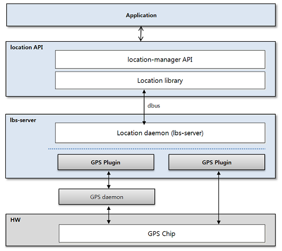
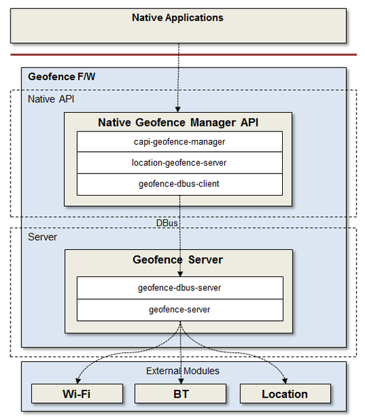
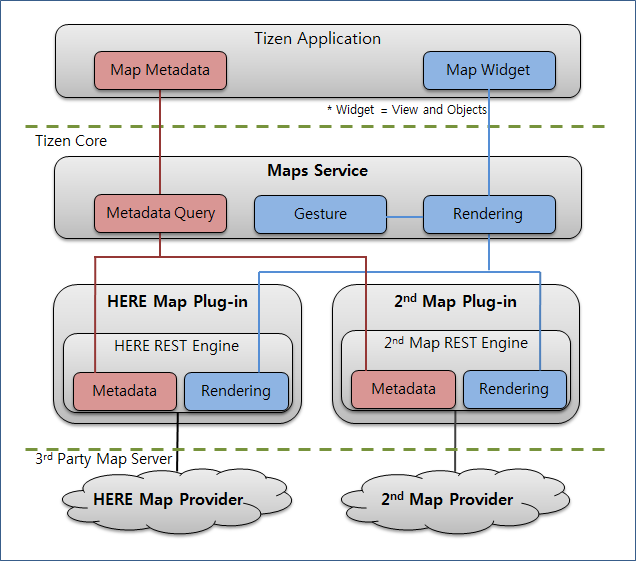

# Location

The Location framework provides location-based services (LBS), including the position information, satellite information and GPS status.

You can use the following location features:

- Getting the current position, last known position, accuracy, distance, and velocity of the device
- Getting satellite information from GPS and GLONASS
- Notifying a user when they enter or exit a predefined set of boundaries, known as geofence, like school attendance zones or neighborhood boundaries

**Figure: Tizen location architecture**



The main location service components are:

- Location framework
- Location manager
- Location library, which contains the location providers that can be used by the location manager to get services
- GPS (global positioning system), which provides position information, velocity, and satellite information. It is used to get the current position of a device.
- dbus, which is the IPC used to communicate between the location module and the Location daemon.
- lbs-server, which provides position, velocity, NMEA, and satellite information by communicating with a GPS chip. It has the following functionalities:
  - Initializes and deinitializes the GPS, opens and closes GPS applications.
  - Provides the position result for the location library.
  - Manages location sessions; determines session termination based on session status.
  - Provides a serial interface with the GPS receiver.
  - Enables the GPS chipset to support standalone GPS positioning methods.
  - Supports the standalone operation mode.


### Porting the OAL Interface

The GPS plugin is implemented for vendor-specific GPS devices based on the Tizen lbs-server. The GPS plugin is implemented as a shared library and the lbs-server loads a specific GPS plugin at runtime. A GPS plugin must be written with predefined interfaces.

The `lbs-server-plugin-dev` source package is installed on OBS by adding the following command in the package spec file:

```
BuildRequires: pkgconfig(lbs-server-plugin)
```

The `lbs-server-plugin-dev` package source files can be found in the following directories:

```
/usr/include/lbs-server-plugin/*.h
/usr/lib/pkgconfig/lbs-server-plugin.pc
```

The `gps_plugin_intf.h` header file includes the API interfaces for the communication between the lbs-server and its GPS plugin.

```cpp
typedef struct {
    /* Initialize the plugin module and register callback function for event delivery */
    int (*init) (gps_event_cb gps_event_cb, void *user_data);
    /* Deinitialize the plugin module */
    int (*deinit) (gps_failure_reason_t *reason_code);
    /* Request specific action to plugin module */
    int (*request) (gps_action_t gps_action, void *gps_action_data, gps_failure_reason_t *reason_code);
} gps_plugin_interface;
```

```cpp
const gps_plugin_interface *get_gps_plugin_interface();
```

The `get_gps_plugin_interface()` function must be exported in the GPS plugin. It gives the `gps_plugin_interface` structure to the lbs-server, and the lbs-server communicates through these interfaces. When the lbs-server is started, the GPS plugin is loaded and the `init()` function is called. At this moment, a GPS device must be initialized.

```cpp
int (*init) (gps_event_cb gps_event_cb, void *user_data);
```

When the `init()` function is called, the `gps_event_cb` callback is set. GPS events and data from a GPS device are delivered through the callback.

```cpp
typedef int (*gps_event_cb) (gps_event_info_t *gps_event_info, void *user_data);
```

The following example describes the GPS events:

```cpp
typedef enum {
    GPS_EVENT_START_SESSION = 0x0000, /* The session is started */
    GPS_EVENT_STOP_SESSION, /* The session is stopped */
    GPS_EVENT_CHANGE_INTERVAL, /* Change updating interval */
    GPS_EVENT_REPORT_POSITION = 0x0100, /* Bring up GPS position data */
    GPS_EVENT_REPORT_SATELLITE, /* Bring up GPS SV data */
    GPS_EVENT_REPORT_NMEA, /* Bring up GPS NMEA data */
    GPS_EVENT_SET_OPTION = 0x0200, /* The option is set */
    GPS_EVENT_GET_REF_LOCATION = 0x0300, /* Get the reference location for AGPS */
    GPS_EVENT_GET_IMSI, /* Get IMSI for identification */
    GPS_EVENT_OPEN_DATA_CONNECTION = 0x0400, /* Request opening data network connection */
    GPS_EVENT_CLOSE_DATA_CONNECTION, /* Request closing data network connection */
    GPS_EVENT_DNS_LOOKUP_IND, /* Request resolving host name */
    GPS_EVENT_AGPS_VERIFICATION_INDI, /* Verification indicator for AGPS is required */
    GPS_EVENT_FACTORY_TEST = 0x0500,/* Factory test is done */
    GPS_EVENT_ERR_CAUSE = 0xFFFF /* Some error is occurred */
} gps_event_id_t;
```

The GPS events contain specific GPS event data which is part of the delivered `gps_event_data_t` (see the `gps_plugin_intf.h` file). When the lbs-server wants to make a request to a GPS device, the `request()` function is called:

```cpp
int (*request) (gps_action_t gps_action, void *gps_action_data, gps_failure_reason_t *reason_code);
```

Each request is classified by `gps_action_t`.

```cpp
typedef enum {
    GPS_ACTION_SEND_PARAMS = 0x00,
    GPS_ACTION_START_SESSION,
    GPS_ACTION_STOP_SESSION,
    GPS_ACTION_CHANGE_INTERVAL,
    GPS_INDI_SUPL_VERIFICATION,
    GPS_INDI_SUPL_DNSQUERY,
    GPS_ACTION_START_FACTTEST,
    GPS_ACTION_STOP_FACTTEST,
    GPS_ACTION_REQUEST_SUPL_NI,
    GPS_ACTION_DELETE_GPS_DATA,
} gps_action_t;
```

With the standalone GPS (unassisted GPS), the `GPS_ACTION_START_SESSION` and `GPS_ACTION_STOP_SESSION` are mandatory actions. If the `GPS_ACTION_START_SESSION` is delivered, the GPS plugin starts the acquisition of satellites and reports the `GPS_EVENT_START_SESSION` event to the lbs-server through the `gps_event_cb` callback. Once the acquisition is completed and position is fixed, the position must be delivered by the `gps_event_cb` callback with the `GPS_EVENT_REPORT_POSITION` event ID and the position data.

To shut down the lbs-server, deinitialize the GPS device with the `deinit()` function:

```cpp
int (*deinit) (gps_failure_reason_t *reason_code);
```

### Adding a new GPS plugin

The `check_plugin_module(char* module_name)` function checks the access to the available plugin in the `/sys/devices/platform` directory and the `load_plugin_module` loads the plugin during the boot up time.

Add the necessary path definitions:

```cpp
#define PLATFORM_PATH "/sys/devices/platform"
#define PLUGIN_PATH PLATFORM_PATH"/xxxxx_gps"
```

## Geofence

The Geofence Manager API provides a service related to geofence. A geofence is a virtual perimeter for a real-world geographic area.

**Figure: Tizen geofence architecture**



You can set a geofence based on a geopoint, a Wi-Fi MAC address, or a Bluetooth address. Notifications are provided for events, such as changes in the service status.

There are 2 kinds of places and fences:

- Public places and fences that are created by the MyPlace application can be used by all applications.
- Private places and fences that are created by a specific application can only be used by that same application.

Notifications can be received about the following events:

- Zone in event when a device enters a specific area
- Zone out event when a device exits a specific area
- Results and errors for each event requested by the geofence module

## Map Service

The Location Maps API (Maps API) allows you to create map-aware applications.

**Figure: Tizen Maps API**



The Maps API has the following features:

- Geocoder (geocoding and reverse geocoding)
- Places (search places)
- Routes (search directions)
- Map Widget (rendering map images)

The Maps API allows you to select a map service provider to be included in the plugins.

### Porting the OAL Interface

The Maps plugin is implemented as a shared library and the Maps framework loads a specific Maps plugin at runtime. A Maps plugin must be written with predefined interfaces.

The `capi-maps-service-plugin-devel` source package is installed on OBS by adding the following command in the package specification file:

```
BuildRequires: pkgconfig(capi-maps-service-plugin-devel)
```

The `capi-maps-service-plugin-devel` package source files can be found in the following directories:

```
/usr/include/maps/maps_plugin*.h
/usr/include/maps/maps_*_plugin.h
/usr/include/maps/maps_extra_types.h
```

The `module.h` header file includes the API interfaces for the communication between the Maps and its plugin.

```cpp
typedef struct _interface_s {
    /* Plugin dedicated functions */
    maps_plugin_init_f maps_plugin_init;
    maps_plugin_shutdown_f maps_plugin_shutdown;
    maps_plugin_get_info_f maps_plugin_get_info;
    maps_plugin_init_module_f maps_plugin_init_module;

    /* Maps Provider access key, preference, and capabilities */
    maps_plugin_set_provider_key_f maps_plugin_set_provider_key;
    maps_plugin_get_provider_key_f maps_plugin_get_provider_key;
    maps_plugin_set_preference_f maps_plugin_set_preference;
    maps_plugin_get_preference_f maps_plugin_get_preference;
    maps_plugin_is_service_supported_f maps_plugin_is_service_supported;
    maps_plugin_is_data_supported_f maps_plugin_is_data_supported;

    /* Geocode */
    maps_plugin_geocode_f maps_plugin_geocode;
    maps_plugin_geocode_inside_area_f maps_plugin_geocode_inside_area;
    maps_plugin_geocode_by_structured_address_f maps_plugin_geocode_by_structured_address;
    maps_plugin_reverse_geocode_f maps_plugin_reverse_geocode;
    maps_plugin_multi_reverse_geocode_f maps_plugin_multi_reverse_geocode;

    /* Place */
    maps_plugin_search_place_f maps_plugin_search_place;
    maps_plugin_search_place_by_area_f maps_plugin_search_place_by_area;
    maps_plugin_search_place_by_address_f maps_plugin_search_place_by_address;
    maps_plugin_search_place_list_f maps_plugin_search_place_list;
    maps_plugin_get_place_details_f maps_plugin_get_place_details;

    /* Route */
    maps_plugin_search_route_f maps_plugin_search_route;
    maps_plugin_search_route_waypoints_f maps_plugin_search_route_waypoints;

    /* Cancel request */
    maps_plugin_cancel_request_f maps_plugin_cancel_request;

    /* Mapping */
    maps_plugin_create_map_view_f maps_plugin_create_map_view;
    maps_plugin_destroy_map_view_f maps_plugin_destroy_map_view;
    maps_plugin_render_map_f maps_plugin_render_map;
    maps_plugin_move_center_f maps_plugin_move_center;
    maps_plugin_set_scalebar_f maps_plugin_set_scalebar;
    maps_plugin_get_scalebar_f maps_plugin_get_scalebar;
    maps_plugin_on_object_f maps_plugin_on_object;
    maps_plugin_screen_to_geography_f maps_plugin_screen_to_geography;
    maps_plugin_geography_to_screen_f maps_plugin_geography_to_screen;
    maps_plugin_get_min_zoom_level_f maps_plugin_get_min_zoom_level;
    maps_plugin_get_max_zoom_level_f maps_plugin_get_max_zoom_level;
    maps_plugin_get_center_f maps_plugin_get_center;
    maps_plugin_capture_snapshot_f maps_plugin_capture_snapshot;
} interface_s;
```

These functions must be implemented and exported in the Maps plugin. To create a Maps handle classified by a provider name string, the `maps_plugin_get_info()` function must provide the name. The name is recommended to be capitalized.

The Maps plugins are located in the `/usr/lib/maps/plugins` directory.

#### HERE Maps Plugin

For now, the HERE Maps plugin is embedded in the platform, with the provider name "HERE". To use this plugin, you must get the credential keys from the [HERE developers site](https://developer.here.com/). You may need to pay a fee depending on the expected map service usage.

To get the user consent required by HERE, a user consent application included in the HERE Maps plugin is launched the first time the user attempts to access the map services, if consent has not been given before that time.
