# Multimedia

You can implement various multimedia features, such as camera, audio, and video.

## Camera

The Multimedia camcorder framework controls the GStreamer camera plugin to capture camera data from the device. The kernel interfaces to control the camera device can be different for different chipsets, so the camera HAL (Hardware Abstraction Layer) used by the camera plugin is provided and it must be implemented specifically for each chipset. Each configuration file contains its own specific hardware-dependent information. The Multimedia camcorder framework reads and parses the information in these configuration files.

**Figure: Multimedia camcorder framework**

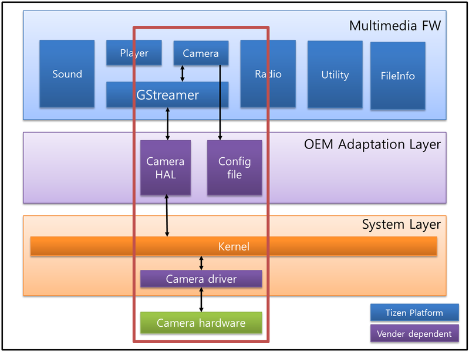

- Camera source plugin for GStreamer  
  Gets the camera data (preview or captured image) and sets various camera commands through camera HAL interface
- Camera HAL  
  Common interface to control the camera device on various shipsets and used by the camera source plugin.
- Configuration files  
  There are 3 config files for the Multimedia camcorder framework. They are provided by `mmfw- sysconf-xxx`:
  - `mmfw_camcorder.ini`
  - `mmfw_camcorder_dev_video_pri.ini`
  - `mmfw_camcorder_dev_video_sec.ini`

### Porting the OAL Interface

Tizen provides a default reference camera source plugin which uses the camera HAL interface.

For the camera HAL, the `mm-hal-interface` package provides a header file:

- Repository path: `platform/core/multimedia/mm-hal-interface`
- File name: `tizen-camera.h`

#### Major Camera HAL Functions

The following list defines the major functions for the camera HAL interface:

- Functions for initialization and deinitialization:

  ```cpp
  /*Initializes new camera HAL handle */
  int camera_init(void **camera_handle);	

  /* Deinitializes the camera HAL handle */
  int camera_deinit(void *camera_handle);
  ```
- Functions for opening and closing the camera device:

  ```cpp
  /* Opens the camera device */
  int camera_open_device(void *camera_handle, int device_index);

  /* Closes the camera device */
  int camera_close_device(void *camera_handle);
  ```
- Functions for getting device information:

  ```cpp
  /* Gets the camera device list */
  int camera_get_device_list(void *camera_handle, camera_device_list_t *device_list);

  /* Registers a callback function to be called to send a message by the camera HAL */
  int camera_add_message_callback(void *camera_handle, camera_message_cb callback, void *user_data, uint32_t *cb_id);

  /* Unregisters a callback function */
  int camera_remove_message_callback(void *camera_handle, uint32_t cb_id);
  ```
- Functions for preview and capture:

  ```cpp
  typedef struct camera_format {
      camera_pixel_format_t stream_format;
      camera_resolution_t stream_resolution;
      uint32_t stream_fps;
      camera_rotation_t stream_rotation;
      camera_pixel_format_t capture_format;
      camera_resolution_t capture_resolution;
      uint32_t capture_quality;
  } camera_format_t;

  /* Sets the format of the preview stream */
  int camera_set_preview_stream_format(void *camera_handle, camera_format_t *format);

  /* Gets the format of the preview stream  */
  int camera_get_preview_stream_format(void *camera_handle, camera_format_t *format);

  typedef int (*camera_preview_frame_cb)(camera_buffer_t *buffer, camera_metadata_t *meta, void *user_data);

  /* Starts the display of preview frames on the scree. */
  int camera_start_preview(void *camera_handle, camera_preview_frame_cb callback, void *user_data);

  /* Stops the preview frames */
  int camera_stop_preview(void *camera_handle);

  /* Releases the preview buffer; the preview buffer must be released with this function after using it */
  int camera_release_preview_buffer(void *camera_handle, int buffer_index);

  /* Starts the camera auto-focusing operation */
  int camera_start_auto_focus(void *camera_handle);

  /* Stops the camera auto-focusing operation */
  int camera_stop_auto_focus(void *camera_handle);

  typedef int (*camera_capture_cb)(camera_buffer_t *main, camera_buffer_t *postview, camera_buffer_t *thumbnail, void *user_data);

  /* Starts capturing still images */
  int camera_start_capture(void *camera_handle, camera_capture_cb callback, void *user_data);

  /* Stops capturing still images */
  int camera_stop_capture(void *camera_handle);
  ```
- Functions for video recording:

  ```cpp
  /* Stops capturing still images */
  int camera_set_video_stream_format(void *camera_handle, camera_format_t *format);

  /* Gets the video stream format for recording */
  int camera_get_video_stream_format(void *camera_handle, camera_format_t *format);

  typedef int (*camera_video_frame_cb)(camera_buffer_t *buffer, camera_metadata_t *meta, void *user_data);

  /* Starts the video frame for recording */
  int camera_start_record(void *camera_handle, camera_video_frame_cb callback, void *user_data);

  /* Stops the video frame */
  int camera_stop_record(void *camera_handle);

  /* Video buffer must be released with this function after using it */
  int camera_release_video_buffer(void *camera_handle, int buffer_index); 
  ```
- Functions for controlling the camera device:

  ```cpp
  #define CAMERA_COMMAND_BASE                     ((int64_t)1)
  #define CAMERA_COMMAND_WHITE_BALANCE            ((int64_t)(CAMERA_COMMAND_BASE << 1))
  #define CAMERA_COMMAND_ISO                      ((int64_t)(CAMERA_COMMAND_BASE << 2))
  #define CAMERA_COMMAND_CONTRAST                 ((int64_t)(CAMERA_COMMAND_BASE << 3))
  #define CAMERA_COMMAND_SATURATION               ((int64_t)(CAMERA_COMMAND_BASE << 4))
  #define CAMERA_COMMAND_HUE                      ((int64_t)(CAMERA_COMMAND_BASE << 5))
  #define CAMERA_COMMAND_SHARPNESS                ((int64_t)(CAMERA_COMMAND_BASE << 6))
  #define CAMERA_COMMAND_EFFECT                   ((int64_t)(CAMERA_COMMAND_BASE << 7))
  #define CAMERA_COMMAND_SCENE_MODE               ((int64_t)(CAMERA_COMMAND_BASE << 8))
  #define CAMERA_COMMAND_EXPOSURE_MODE            ((int64_t)(CAMERA_COMMAND_BASE << 9))
  #define CAMERA_COMMAND_EXPOSURE                 ((int64_t)(CAMERA_COMMAND_BASE << 10))
  #define CAMERA_COMMAND_ROTATION                 ((int64_t)(CAMERA_COMMAND_BASE << 11))
  #define CAMERA_COMMAND_FLIP                     ((int64_t)(CAMERA_COMMAND_BASE << 12))
  #define CAMERA_COMMAND_FOCUS_MODE               ((int64_t)(CAMERA_COMMAND_BASE << 13))
  #define CAMERA_COMMAND_FOCUS_RANGE              ((int64_t)(CAMERA_COMMAND_BASE << 14))
  #define CAMERA_COMMAND_SHOT_MODE                ((int64_t)(CAMERA_COMMAND_BASE << 15))
  #define CAMERA_COMMAND_ANTI_SHAKE               ((int64_t)(CAMERA_COMMAND_BASE << 16))
  #define CAMERA_COMMAND_FOCUS_AREA               ((int64_t)(CAMERA_COMMAND_BASE << 17))
  #define CAMERA_COMMAND_DIGITAL_ZOOM             ((int64_t)(CAMERA_COMMAND_BASE << 18))
  #define CAMERA_COMMAND_OPTICAL_ZOOM             ((int64_t)(CAMERA_COMMAND_BASE << 19))
  #define CAMERA_COMMAND_RECORDING_HINT           ((int64_t)(CAMERA_COMMAND_BASE << 20))
  #define CAMERA_COMMAND_WDR                      ((int64_t)(CAMERA_COMMAND_BASE << 21))
  #define CAMERA_COMMAND_SHUTTER_SPEED            ((int64_t)(CAMERA_COMMAND_BASE << 22))
  #define CAMERA_COMMAND_FLASH_MODE               ((int64_t)(CAMERA_COMMAND_BASE << 23))
  #define CAMERA_COMMAND_FACE_DETECTION           ((int64_t)(CAMERA_COMMAND_BASE << 24))

  /* Sets various commands and values to control the camera device */
  int camera_set_command(void *camera_handle, int64_t command, void *value);

  /* Gets the current value of the command */
  int camera_get_command(void *camera_handle, int64_t command, void *value);

  typedef struct camera_batch_command_control {
      /* Flag for modified command */
      int64_t command_set_flag;

      /* Value list */
      camera_white_balance_t white_balance;
      int iso;
      int contrast;
      int saturation;
      int hue;
      int sharpness;
      camera_effect_t effect;
      camera_scene_mode_t scene_mode;
      camera_exposure_mode_t exposure_mode;
      int exposure;
      camera_rotation_t rotation;
      camera_flip_t flip;
      camera_focus_mode_t focus_mode;
      camera_focus_range_t focus_range;
      camera_exposure_mode_t shot_mode;
      int anti_shake;
      camera_rectangle_t focus_area;
      int digital_zoom;
      int optical_zoom;
      int recording_hint;
      int wdr;
      camera_flash_mode_t flash_mode;
      camera_face_detection_t face_detection;
  } camera_batch_command_control_t;

  /* Sets a batch set of commands */
  int camera_set_batch_command(void *camera_handle, camera_batch_command_control_t *batch_command, int64_t *error_command);
  ```

### Configuration

To configure the camera, read the keywords and their values from the configuration files. Recognize the categories by using the keyword list of the MSL camcorder, and save the member structure of the MSL camcorder. Later, these values are used as attribute values or some other operation. The permission of this file is read-only to make sure the configuration files are read once before creating the camcorder. To add comments in the config file, use a semicolon (";").

The following table shows the description of the `mmfw_camcorder.ini` file.

**Table: mmfw_camcorder.ini file**

| Category    | Entry                         | Description                              |
| ----------- | ----------------------------- | ---------------------------------------- |
| General     |                               | General setting or information           |
|             | `SyncStateChange`             | API running type. This value must be 1 (`TRUE`). |
|             | `ModelName`                   | Model name of target                     |
| Video input |                               | Setting list related to video input      |
|             | `UseConfCtrl`                 | Whether to use the configuration file. This value must be 1 (`TRUE`). |
|             | `ConfCtrlFile0` or `1`        | Name of the setting file to control the camera device |
|             | `VideosrcElement`             | Source plugin which obtains the camera input buffer from the device |
|             | `UseZeroCopyFormat`           | Whether to use the zero copy format      |
|             | `DeviceCount`                 | Number of camera device                  |
|             | `SupportMediaPacketPreviewCb` | Whether the camera API supports media packet preview callback on the target |
| Audio input |                               | Setting list related to audio input      |
|             | `AudiosrcElement`             | Audio source plugin which obtains audio for the camcorder or voice recorder |
|             | `AudiomodemsrcElement`        | Audio source plugin which obtains audio for call recording |
| Video input |                               | Setting list related to video output     |
|             | `DisplayDevice`               | Supported output device list and the default value |
|             | `Videosink`                   | Supported output surface list and the default value |
|             | `VideosinkElementOverlay`     | Plugin name for the Overlay output surface and the property setting list |
|             | `VideosinkElementEvas`        | Plugin name for the Evas output surface and the property setting list |
|             | `VideosinkElementGL`          | Plugin name for the GL output surface and the property setting list |
|             | `VideosinkElementNULL`        | Plugin name for the `NULL` surface and the property setting list |
|             | `Video encoder`               | Video encoder list for video recording   |
|             | `Audio encoder`               | Audio encoder list for AV recording or voice recording |
| Capture     |                               | Setting list related to image capture    |
|             | `UseEncodebin`                | Whether to use the `encodebin` to capture the image. Keep this value as 0 (`FALSE`). |
| Record      |                               | Setting value list for each recording mode. Keep the values of the example config file. |
| Mux         |                               | Mux plugin list related with the file container |

The following table shows the description of the `mmfw_camcorder_dev_video_pri.ini` file for the primary camera (usually the rear camera) and the `mmfw_camcorder_dev_video_sec.ini` file for the secondary camera (usually the front camera).

**Table: mmfw_camcorder_dev_video_pri.ini**

| Category   | Entry                           | Description                              |
| ---------- | ------------------------------- | ---------------------------------------- |
| Camera     |                                 | Information about the camera             |
|            | `InputIndex`                    | Camera number to select (primary or secondary) |
|            | `DeviceName`                    | Name of the camera module                |
|            | `PreviewResolution`             | List of all supported preview resolutions the user can set, as well as the default value for this camera device |
|            | `CaptureResolution`             | List of all supported capture resolutions the user can set, as well as the default value for this camera device |
|            | `VideoResolution`               | List of all supported video resolutions the user can set, as well as the default value for this camera device |
|            | `FPS0 ~ 9`                      | List of all supported FPS (Frame Per Second) settings by preview resolution the user can use, as well as the default value for this camera device |
|            | `PictureFormat`                 | List of all supported preview formats a user can set, as well as the default value for this camera device |
|            | `RecommendDisplayRotation`      | Default display rotation value for displaying camera input |
|            | `RecommendPreviewFormatCapture` | Recommended preview format for capturing images |
|            | `RecommendPreviewFormatRecord`  | Recommended preview format for recording |
|            | `RecommendPreviewResolution`    | Recommended preview resolution by ratio of preview resolution |
|            | `FacingDirection`               | Facing direction of camera device        |
| Strobe     |                                 | Camera flash settings                    |
|            | `StrobeMode`                    | Supported strobe mode and default value. This is converted to a real value and used in the kernel internally. |
| Effect     |                                 | Effect settings                          |
|            | `Brightness`                    | Supported range of brightness and default value |
|            | `Contrast`                      | Supported range of contrast and default value |
|            | `Saturation`                    | Supported range of saturation and default value |
|            | `Sharpness`                     | Supported range of sharpness and default value |
|            | `Whitebalance`                  | Supported white balance list and default value. This is converted to a real value and used in the kernel internally. |
|            | `ColorTone`                     | Supported color tone list and default value. This is converted to a real value and used in the kernel internally. |
|            | `WDR`                           | Supported Wide Dynamic Range mode list and default value. This is converted to a real value and used in the kernel internally. |
| Photograph |                                 | Camera shooting settings                 |
|            | `DigitalZoom`                   | Supported range of digital zoom level and default value |
|            | `OpticalZoom`                   | Supported range of optical zoom level and default value |
|            | `FocusMode`                     | Supported focus mode list and default value. This is converted to a real value and used in the kernel internally. |
|            | `AFType`                        | Supported AUTO Focus mode list and default value. This is converted to a real value and used in the kernel internally. |
|            | `AEType`                        | Supported AUTO Exposure mode list and default value. This is converted to a real value and used in the kernel internally. |
|            | `ExposureValue`                 | Supported range of exposure value and default value |
|            | `ISO`                           | Supported ISO list and default value. This is converted to a real value and used in the kernel internally. |
|            | `ProgramMode`                   | Supported program mode (scene mode) list and default value. This is converted to a real value and used in the kernel internally. |
|            | `AntiHandshake`                 | Supported anti-hand shake mode list and default value. This is converted to a real value and used in the kernel internally. |
| Capture    |                                 | Image capture settings                   |
|            | `OutputMode`                    | Supported capture format list and default value |
|            | `JpegQuality`                   | Supported range of JPEG quality and default value |
|            | `MultishotNumber`               | Supported range of multi shot count and default value |
|            | `SensorEncodedCapture`          | Whether the camera device supports encoded capture format (such as JPEG) |
|            | `SupportHDR`                    | Supported HDR mode list and default value |
|            | `SupportZSL`                    | Whether the camera device supports zero shutter lag capture |
| Detect     |                                 | Detect function settings                 |
|            | `DetectMode`                    | Supported detect mode list and default value |

### References

- Driver configuration  
  Set the kernel `.config` values for the camera:
  ```
  CONFIG_VIDEO_DEV = y
  CONFIG_VIDEO_SAMSUNG = y
  CONFIG_VIDEO_SAMSUNG_V4L2 = y
  CONFIG_VIDEO_FIMC = y
  CONFIG_VIDEO_FIMC_MMAP_OUTPUT_CACHE = y
  CONFIG_VIDEO_FIMC_MIPI = y
  CONFIG_VIDEO_FIMG2D = y
  CONFIG_VIDEO_JPEG = y
  CONFIG_VIDEO_MFC5X = y
  ```
- Kernel node
  ```
  For Camera: /dev/video1
  Other CAMIF interfaces: /dev/video(0-3)
  ```
- GStreamer  
  For more information about GStreamer, see [http://gstreamer.freedesktop.org/documentation/](http://gstreamer.freedesktop.org/documentation/) and [http://gstreamer.freedesktop.org/data/doc/gstreamer/head/pwg/html/index.html](http://gstreamer.freedesktop.org/data/doc/gstreamer/head/pwg/html/index.html).
- V4L2  
  For more information about V4L2, see [http://v4l2spec.bytesex.org/spec-single/v4l2.html](http://v4l2spec.bytesex.org/spec-single/v4l2.html).

## Radio

The radio interface part of the multimedia framework supports APIs to implement the following FM radio features:

- Tuning a frequency
- Getting and setting a frequency
- Scanning all available frequencies
- Seeking up and down
- Getting the frequency signal

**Figure: Multimedia radio framework**

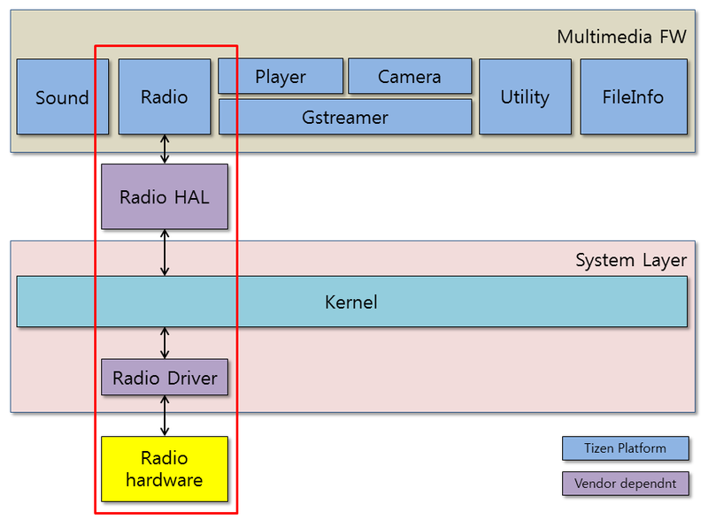

Because the interfaces for controlling the radio device differ, Tizen provides the Radio Hardware Abstraction Layer (HAL) to control various radio devices with a common interface. With the common interface, you can control the radio device on various chipsets used by the `libmm-radio`.

### Porting the OAL Interface

The OAL interface for FM radio is the radio HAL interface.

The `mm-hal-interface` package provides the radio HAL header file:

- Repository path: `platform/core/multimedia/mm-hal-interface`
- File name: `tizen-radio.h`

The OAL interface for FM radio is the [Linux](https://wiki.tizen.org/Linux) kernel V4L2 interface. The radio module directly uses the V4L2 `ioctls` to perform various radio hardware configurations.

#### Major Radio HAL Functions

The following list defines the major functions for the radio HAL interface:

- Functions for initialization and deinitialization:

  ```cpp
  /* Initializes a new radio HAL handle */
  radio_error_t radio_init(void **radio_handle);

  /* Deinitializes the radio HAL handle */
  radio_error_t radio_deinit(void *radio_handle);
  ```

- Functions for preparing and unpreparing the radio device:

  ```cpp
  /* Prepares the radio device */
  radio_error_t radio_prepare_device(void *radio_handle);
  
  /* Unprepares the radio device */
  radio_error_t radio_unprepare_device(void *radio_handle);
  ```

- Functions for opening and closing the radio device:

  ```cpp
  /* Opens the radio device */
  radio_error_t radio_open_device(void *radio_handle);

  /* Closes the radio device */
  radio_error_t radio_close_device(void *radio_handle);
  ```

- Functions for starting and stopping the radio device:

  ```cpp
  /* Starts the radio device */
  radio_error_t radio_start(void *radio_handle);

  /* Stops the radio device */
  radio_error_t radio_stop(void *radio_handle);
  ```

- Functions for setting and getting the frequency:

  ```cpp
  /* Gets the radio frequency */
  radio_error_t radio_get_frequency(void *radio_handle, uint32_t *frequency);

  /* Sets the radio frequency */
  radio_error_t radio_set_frequency(void *radio_handle, uint32_t frequency);
  ```

- Functions for seeking channels:

  ```cpp
  typedef enum radio_seek_direction_type {
      RADIO_SEEK_DIRECTION_UP, /* Seek upward */
      RADIO_SEEK_DIRECTION_DOWN /* Seek downward */
  } radio_seek_direction_type_t;

  /* Asynchronously seeks (up or down) the effective frequency of the radio */
  radio_error_t radio_seek(void *radio_handle, radio_seek_direction_type_t direction);
  ```

- Functions for  muting and unmuting the radio device:

  ```cpp
  /* Mutes the radio */
  radio_error_t radio_mute(void *radio_handle);

  /* Unmutes the radio */
  radio_error_t radio_unmute(void *radio_handle);
  ```


- Functions for setting and getting the volume:

  ```cpp
  /* Gets the current radio volume */
  radio_error_t radio_get_volume(void *radio_handle, float *volume);

  /* Sets the current radio volume */
  radio_error_t radio_set_volume(void *radio_handle, float volume);

  /* Sets the current media volume level (system media volume) */
  radio_error_t radio_set_media_volume(void *radio_handle, uint32_t level);
  ```

- Functions for getting the signal strength:

  ```cpp
  /* Gets the current signal strength of the radio */
  radio_error_t radio_set_media_volume(void *radio_handle, uint32_t level);
  ```

### References

- Kernel node

  ```
  For Radio: /dev/radio0
  ```

## Audio

The following figure illustrates the different audio layers.

**Figure: Audio layers**

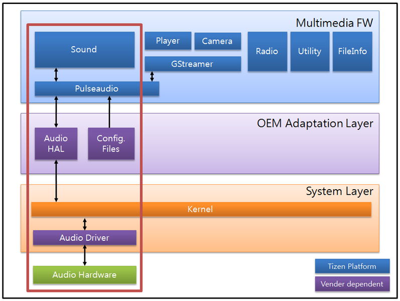

- PulseAudio
  - PulseAudio is a sound server accepting sound input from 1 or more sources and redirecting it to 1 or more sinks. It has the following features:
    - Software mixing of multiple audio streams
    - Support for multiple audio sources and sinks
    - An extensible plugin architecture with support for loadable modules
    - Low-latency operation
    - Support for external devices, such as Bluetooth audio and USB audio devices
  - Pulseaudio interacts with AudioHAL interfaces to support various device types.
- Audio HAL
  - Predefined interfaces for Audio Hardware Abstraction Layer (HAL)
  - Interfaces include the following categories: volume, route, stream, PCM
- Configuration files  
  Configurations for running Pulseaudio and Audio Systems which can be modified without code changes.
  - pulseaudio configurations (such as `daemon.conf`, `client.conf`, `system.pa`)
  - stream/device configuration (`stream-map.json`, `device-map.json`)

### Porting the OAL Interface

The following example defines the major functions for the audio HAL interface:

```cpp
/* Initializes the audio HAL handle */
audio_return_t audio_init(void **audio_handle); 

/* Deinitializes the audio HAL handle */
audio_return_t audio_deinit(void *audio_handle);

/* Gets the maximum volume level supported for a particular volume information */
audio_return_t audio_get_volume_level_max(void *audio_handle, audio_volume_info_t *info, uint32_t *level);

/* Gets the volume level specified for a particular volume information */
audio_return_t audio_get_volume_level(void *audio_handle, audio_volume_info_t *info, uint32_t *level); 

/* Sets the volume level specified for a particular volume information */
audio_return_t audio_set_volume_level(void *audio_handle, audio_volume_info_t *info, uint32_t level); 

/* Gets the volume value specified for a particular volume information and level */
audio_return_t audio_get_volume_value(void *audio_handle, audio_volume_info_t *info, uint32_t level, double *value); 

/* Gets the volume mute specified for a particular volume information */
audio_return_t audio_get_volume_mute(void *audio_handle, audio_volume_info_t *info, uint32_t *mute); 

/* Sets the volume mute specified for a particular volume information */
audio_return_t audio_set_volume_mute(void *audio_handle, audio_volume_info_t *info, uint32_t mute); 

/* Updates the audio routing according to audio route information */
audio_return_t audio_update_route(void *audio_handle, audio_route_info_t *info); 

/* Updates audio routing option according to audio route option */
audio_return_t audio_update_route_option(void *audio_handle, audio_route_option_t *option); 

/* Notifies when a stream is connected and disconnected */
audio_return_t audio_notify_stream_connection_changed(void *audio_handle, audio_stream_info_t *info, uint32_t is_connected); 

/* Opens a PCM device */
audio_return_t audio_pcm_open(void *audio_handle, void **pcm_handle, uint32_t direction, void *sample_spec, uint32_t period_size, uint32_t periods); 

/* Starts a PCM device */
audio_return_t audio_pcm_start(void *audio_handle, void *pcm_handle);

/* Stops a PCM device */
audio_return_t audio_pcm_stop(void *audio_handle, void *pcm_handle);

/* Closes a PCM device */
audio_return_t audio_pcm_close(void *audio_handle, void *pcm_handle);

/* Gets the available number of frames */
audio_return_t audio_pcm_avail(void *audio_handle, void *pcm_handle, uint32_t *avail);

/* Writes frames to a PCM device */
audio_return_t audio_pcm_write(void *audio_handle, void *pcm_handle, const void *buffer, uint32_t frames); 

/* Reads frames from a PCM device */
audio_return_t audio_pcm_read(void *audio_handle, void *pcm_handle, void *buffer, uint32_t frames); 

/* Gets the poll descriptor for a PCM handle */
audio_return_t audio_pcm_get_fd(void *audio_handle, void *pcm_handle, int *fd); 

/* Recovers the PCM state */
audio_return_t audio_pcm_recover(void *audio_handle, void *pcm_handle, int revents); 

/* Gets the parameters of a PCM device */
audio_return_t audio_pcm_get_params(void *audio_handle, void *pcm_handle, uint32_t direction, void **sample_spec, uint32_t *period_size, uint32_t *periods); 

/* Sets the hardware and software parameters of a PCM device */
audio_return_t audio_pcm_set_params(void *audio_handle, void *pcm_handle, uint32_t direction, void *sample_spec, uint32_t period_size, uint32_t periods); 
```

### Configuration

To support a variety of devices, PulseAudio and device configuration have to be modified by the vendor. The following table shows the PulseAudio configuration.

**Table: PulseAudio configuration**

| Configuration            | Description                              |
| ------------------------ | ---------------------------------------- |
| `/etc/pulse/daemon.conf` | Configuration file for the PulseAudio daemon. In this file, the PulseAudio daemon properties, such as priority, log-level, resampling method, and default sample rate, can be modified. In Tizen, the PulseAudio daemon must be running in system mode, not user mode. |
| `/etc/pulse/client.conf` | Configuration file for the PulseAudio clients. It is generally not necessary to modify this file. |
| `/etc/pulse/system.pa`   | PulseAudio Sound Server startup script. This startup script is used only if PulseAudio is started in system mode. Initial module loading is triggered by this file, so any vendor-specific modules to be loaded must be added here. |
| `/etc/pulse/default.pa`  | PulseAudio Sound Server startup script. This startup script is used only if PulseAudio is started in user mode. Currently Tizen does not support this mode. |

Stream and device configuration:

- Stream map: Latency, volume, and streams can be configured in the `/etc/pulse/stream-map.json` file:

  ```json
  {
      "latencies":[
          {
              "type":"low",
              "fragsize-ms":25,
              "minreq-ms":-1,
              "tlength-ms":100,
              "prebuf-ms":0,
              "maxlength":-1,
          },   
          {
              "type":"high",
              "fragsize-ms":75,
              "minreq-ms":-1,
              "tlength-ms":400,
              "prebuf-ms":0,
              "maxlength":-1,
          },
      ],
      "volumes":[
          {
              "type":"media",
              "is-hal-volume":1,
          },
          {
              "type":"system",
              "is-hal-volume":0,
          },
          {
              "type":"notification",
              "is-hal-volume":0,
          },
          {
              "type":"ringtone",
              "is-hal-volume":0,
          },
          {
              "type":"call",
              "is-hal-volume":1,
          },   
      ],
      "streams":[
          {
              "role":"media",
              "priority":3,
              "route-type":"auto",
              "volume-types":{"in":"none","out":"media"},
              "avail-in-devices":["audio-jack","builtin-mic"],
              "avail-out-devices":["forwarding","audio-jack","bt","builtin-speaker"],
              "avail-frameworks":["player","wav-player","tone-player","audio-io","recorder"],
          },
          {
              "role":"system",
              "priority":2,
              "route-type":"auto",
              "volume-types":{"in":"none","out":"system"},
              "avail-in-devices":["none"],
              "avail-out-devices":["forwarding","audio-jack","bt","builtin-speaker"],
              "avail-frameworks":["player","wav-player","tone-player","audio-io"],
          },
          {
              "role":"notification",
              "priority":4,
              "route-type":"auto-all",
              "volume-types":{"in":"none","out":"notification"},
             "avail-in-devices":["none"],
              "avail-out-devices":["audio-jack","bt","builtin-speaker"],
              "avail-frameworks":["player","wav-player","tone-player","audio-io"],
          },
          {
              "role":"ringtone-call",
              "priority":6,
              "route-type":"auto-all",
              "volume-types":{"in":"none","out":"ringtone"},
              "avail-in-devices":["none"],
              "avail-out-devices":["audio-jack","bt","builtin-speaker"],
              "avail-frameworks":["player","wav-player","tone-player","audio-io"],
          },
          {
              "role":"call-voice",
              "priority":6,
              "route-type":"manual",
              "volume-types":{"in":"none","out":"call"},
              "avail-in-devices":["builtin-mic","audio-jack","bt"],
              "avail-out-devices":["builtin-receiver","builtin-speaker","audio-jack","bt"],
              "avail-frameworks":["sound-manager"],
          },	
      ]
  }
  ```
- Device map: Device types and device files can be configured in the `/etc/pulse/device-map.json` file:

  ```json
  {
      "device-types":[
          {
              "device-type":"builtin-speaker",
              "builtin":true,
              "direction":["out"],
              "avail-condition":["pulse"],
              "playback-devices":{"normal":"alsa:sprdphone,0", "call-voice":"alsa:VIRTUALAUDIOW,0"}
          },
          {
              "device-type":"builtin-mic",
              "builtin":true,
              "direction":["in"],
              "avail-condition":["pulse"],
              "capture-devices":{"normal":"alsa:sprdphone,0"}
          },
          {
              "device-type":"audio-jack",
              "builtin":false,
              "direction":["both","out"],
              "avail-condition":["pulse","dbus"],
              "playback-devices":{"normal":"alsa:sprdphone,0", "call-voice":"alsa:VIRTUALAUDIOW,0"},
              "capture-devices":{"normal":"alsa:sprdphone,0"}
          },
          {
              "device-type":"bt",
              "profile":"a2dp",
              "builtin":false,
              "direction":["out"],
              "avail-condition":["pulse"]
          },
          {
              "device-type":"bt",
              "profile":"sco",
              "builtin":false,
              "direction":["both"],
              "avail-condition":["pulse","dbus"],
              "playback-devices":{"normal":"alsa:sprdphone,0", "call-voice":"alsa:VIRTUALAUDIOW,0"},
              "capture-devices":{"normal":"alsa:sprdphone,0"}
          },
          {
              "device-type":"usb-audio",
              "builtin":false,
              "direction":["both", "in", "out"],
              "avail-condition":["pulse"]
          }  
      ],
      "device-files":
      {
          "playback-devices":[
              {
                  "device-string":"alsa:sprdphone,0",
                  "role":
                  {
                      "normal":"rate=44100",
                  }
              },
              {
                  "device-string":"alsa:VIRTUALAUDIOW,0",
                  "role":
                  {
                      "call-voice":"rate=16000 channels=1 tsched=0 alternate_rate=16000",
                  }
              }
          ],
          "capture-devices":[
              {
                  "device-string":"alsa:sprdphone,0",
                  "role":{"normal":"rate=44100"}
              }
          ]
      }
  }
  ```

### References

- Driver configuration for the Samsung chipset  
  The following list is an example of the kernel `.config` values to be set for audio when using the Samsung chipset.
  ```
  CONFIG_SOUND=y
  CONFIG_SND=y
  CONFIG_SND_TIMER=y
  CONFIG_SND_HWDEP=y
  CONFIG_SND_JACK=y
  CONFIG_SND_SOC = y
  CONFIG_SND_SOC_SAMSUNG = y
  CONFIG_SND_SAMSUNG_I2S = y
  CONFIG_SND_SOC_SLP_TRATS_MC1N2 = y
  CONFIG_SND_SOC_I2C_AND_SPI = y
  CONFIG_SND_SOC_MC1N2=y
  ```
- PulseAudio  
  Version: 5.0  
  Website: [http://www.freedesktop.org/wiki/Software/PulseAudio](http://www.freedesktop.org/wiki/Software/PulseAudio)
- ALSA  
  Website: [http://www.alsa-project.org](http://www.alsa-project.org/)

## Player

The multimedia player framework controls the player plugins (demuxer, codecs, and renderer plugins) of the GStreamer to play media content. The kernel interfaces to control codecs can be different for different chipsets, so the corresponding codec plugins must be implemented specifically for each chipset.

**Figure: Multimedia player framework**

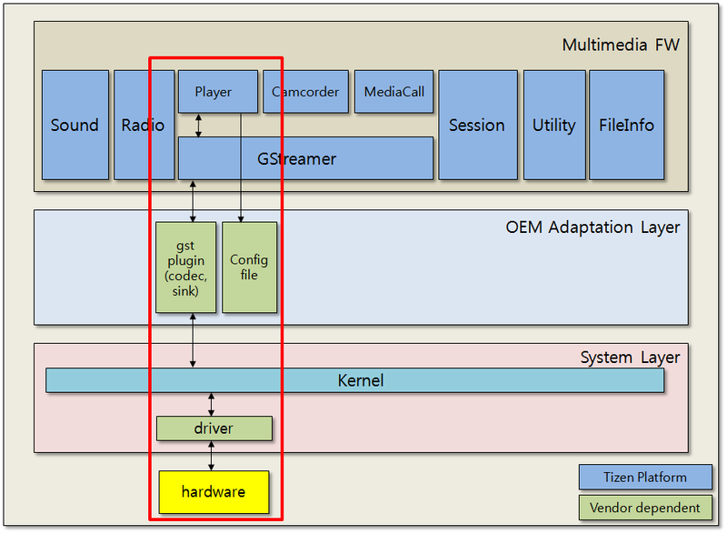

### Porting the OAL Interface

There is no specific OAL for the multimedia player framework. The OAL interface for the player plugins consists of the `gst-omx` codec plugins and video/audio renderer plugins. For more information on the `gst-omx` plugin, see [Codec > Porting OAL Interface](#porting-the-oal-interface). For more information about Avsystem for audio, see [Audio](#audio). For more information on Wayland (UI-framework) for display, see [Video](#videosink).

**Figure: Player plugins**


### Configuration

- Configuration file:
  - The multimedia player framework uses the `mmfw_player.ini` configuration file to set various parameters for selecting different codecs and display plugins.
  - The `mmfw_player.ini` configuration file is provided by the `mmfw-sysconf-xxx` package.
  - In the final stage of development, the permission for this file needs to be changed to read-only.
- Configuring the player:
  - File name: `mmfw_player.ini`
  - 1 `player.ini` file is needed in each board (or model).
  - Codec plugins for the board are located in the `/usr/lib/gstreamer-1.0` directory. Changing the codec plugin does not mean modifying this `.ini` file because the player supports the auto plugin feature.
- As needed, the following setting values can be used:
  - Exclude keyword element
  - Audio filter

### References

- Display driver configuration for the Samsung chipset  
  The following list is an example of the kernel `.config` values to be set for display in the Samsung chipset.
  ```
  CONFIG_DRM = y
  CONFIG_FB = y
  CONFIG_FB_S3C = y
  CONFIG_FB_S3C_LCD_INIT = y
  CONFIG_FIMD_EXT_SUPPORT = y
  CONFIG_FIMD_LITE_SUPPORT = y
  ```
- Kernel node
  - Frame buffers: `/dev/fb(0-4)`
  - `gst-omx` version : 1.2.0
    - [http://gstreamer.freedesktop.org/src/gst-omx/](http://gstreamer.freedesktop.org/src/gst-omx/)
    - [http://www.freedesktop.org/wiki/GstOpenMAX](http://www.freedesktop.org/wiki/GstOpenMAX)
  - For all GStreamer documentation, see [http://gstreamer.freedesktop.org/documentation/](http://gstreamer.freedesktop.org/documentation/).
  - For developing GStreamer plugins, see [http://gstreamer.freedesktop.org/data/doc/gstreamer/head/pwg/html/index.html](http://gstreamer.freedesktop.org/data/doc/gstreamer/head/pwg/html/index.html).
  - For more information about OpenMAX IL components, see [http://www.khronos.org/openmax/il/](http://www.khronos.org/openmax/il/).

## Codec

The following figure illustrates the codecs and their relations. It shows 2 types of codec plugins, the Gstreamer and OpenMAX.

**Figure: Multimedia codecs**

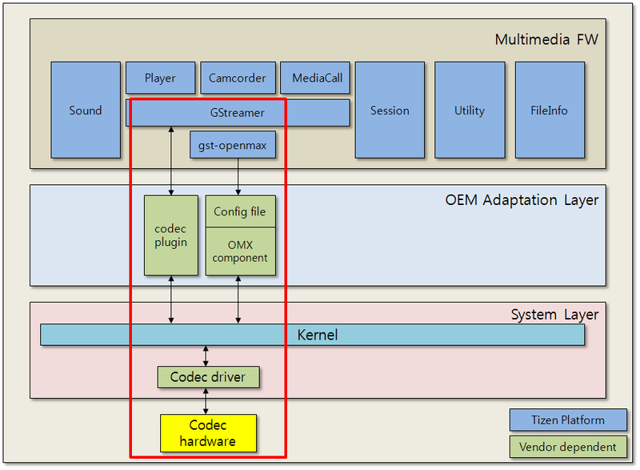

- Gstreamer codec plugin
  - The Gstreamer codec plugin can be linked to and easily used in the Gstreamer pipeline, which is used in the multimedia framework.
  - In addition, to link a Gstreamer pipeline, the capability of the codec plugin can be negotiated with the linked element in the pipeline.
  - To get detailed information, such as the capability of an element, use the `#gst-inspect-1.0 (element name)` command.  
    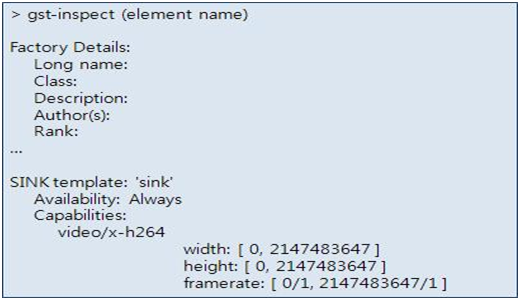
- OpenMAX codec plugin
  - Some of the codec vendors provide OpenMAX IL components and not Gstreamer plugins. Tizen provides the `gst-omx` plugins to use the OpenMAX IL components. The Gstreamer pipeline used in the multimedia framework can control and transfer data to OpenMAX IL component using the `gst-omx` plugin.
  - To use the OpenMAX component in Gstreamer, the `gst-omx` (open source) package is provided. By using this package, Gstreamer can recognize and use an OpenMAX component as a Gstreamer element. `gst-omx` is a Gstreamer plugin that allows communication with OpenMAX IL components. The usage of the `gst-omx` plugin is the same as other Gstreamer plugins.
  - For more detailed information about this plugin, see [http://www.freedesktop.org/wiki/GstOpenMAX](http://www.freedesktop.org/wiki/GstOpenMAX). For more information about OpenMAX IL, see [http://www.khronos.org/openmax/](http://www.khronos.org/openmax/).
  - The `gst-omx` plugin refers to a `gstomx.conf` configuration file. This file is included in the `gst-omx` package, and installed to the `/etc/xdg/gst-omx.conf` directory in the target device.

### Porting the OAL Interface

The OpenMAX plugin is an industry standard that provides an abstraction layer for computer graphics, video, and sound routines. The interface abstracts the hardware and software architecture in the system. The OpenMAX IL API allows the user to load, control, connect, and unload the individual components. This flexible core architecture allows the Integration Layer to easily implement almost any media use case and mesh with existing graph-based media frameworks. The key focus of the OpenMAX IL API is portability of media components. OpenMAX IL interfaces between the media framework, such as GStreamer, and a set of multimedia components (such as an audio or video codecs). `gst-omx` is a GStreamer plug-in package that allows communication with OpenMAX IL components. The `gst-omx` structuring is classified into different object classes based on the functionality. The following figure shows the object structuring of a video decoder plugin in `gst-omx`.

**Figure: gst-omx structuring**

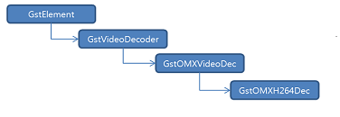

The `GstVideoDecoder` base class for video decoders provides encoded data to derived `GstOMXVideoDec`. Each input frame is provided in turn to the subclass's `handle_frame` callback. The `GstVideoDecoder` base class and derived subclass cooperate in the following manner:

1. Configuration
   - `GstVideoDecoder` calls the `start()` function when the decoder element is activated.
   - `GstVideoDecoder` calls the `set_format()` function to inform the subclass of caps describing the input video data.
2. Data processing
   - Each input frame is provided in turn to the subclass's `handle_frames()` function.
   - The subclass calls the `gst_video_decoder_finish_frame()` or `gst_video_decoder_drop_frame()` function.
3. Shutdown phase
   - The `GstVideoDecoder` class calls the `stop()` function.

### Configuration

The `gst-omx` plugin uses a configuration file, such as `gstomx.conf`. This file is included in the `gst-omx` package, and installed in the `/etc/xdg/gstomx.conf` directory on the target device. The `gstomx.conf` file needs to be changed according to the OpenMAX component vendor. The following figures lists the values of each item in the lists separated by commas. Each Gstreamer element is separated by a semicolon.

**Figure: gstomx.conf elements**

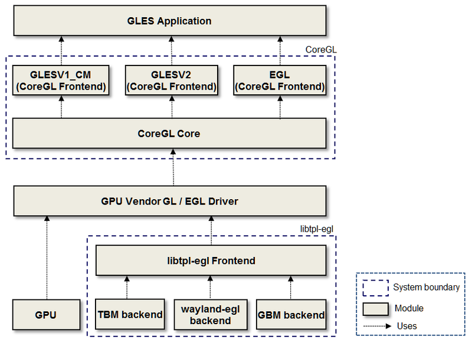

**Figure: gstomx.conf example**

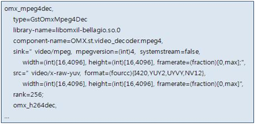

Each value needs to be changed according to the OpenMAX component vendor. When you are finished with these settings, the result is a Gstreamer type codec plugin, and you can test the codec the same way.

- Using the codec plugin in the player  
  Because the player uses auto plugging, it does not need an additional setting.
  - If the decoder plugin has an acceptable capability, this plugin can be linked with a player pipeline in order of rank.
  - If the codec name is included in the excluded keyword in the `/usr/etc/mmfw_player.ini` file (`mmfw-sysconf` package), it is excluded in the player pipeline.
- Using the codec plugin in the camcorder  
  Because the camcorder clarified its audio, video, and image encoder in the `/usr/etc/mmfw_camcorder.ini` file (`mmfw-sysconf` package), you need to change this category value to set your own codec name.

  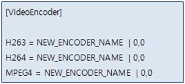

### References

- `gst-omx` version: 1.2  
  [http://gstreamer.freedesktop.org/src/gst-omx/](http://gstreamer.freedesktop.org/src/gst-omx/)  
  [http://www.freedesktop.org/wiki/GstOpenMAX](http://www.freedesktop.org/wiki/GstOpenMAX)
- For all GStreamer documentation, see [http://gstreamer.freedesktop.org/documentation/](http://gstreamer.freedesktop.org/documentation/).
- For developing GStreamer plug-ins, see [http://gstreamer.freedesktop.org/data/doc/gstreamer/head/pwg/html/index.html](http://gstreamer.freedesktop.org/data/doc/gstreamer/head/pwg/html/index.html).
- For more information about OpenMAX IL components, see [http://www.khronos.org/openmax/il/](http://www.khronos.org/openmax/il/).


## Videosink

The videosink renders a video frame buffer from a previous gst element on a local display using Waylandsink (since Tizen 3.0). It is used with a camera or player that requires video output. This element can receive a surface ID of a window from the application through the `GstVideoOverlay` interface (`set_wl_window_wl_surface_id()`) and renders the video frame in this window. If no surface ID was provided by the application, the element creates its own internal window and renders into it.

The following figure shows the video rendering process in the player. The white box is the gstreamer element. GstBuffer is streaming from filesrc to Waylandsink past the video codec. The GstBuffer is TBM or SHM.

**Figure: Video rendering process**

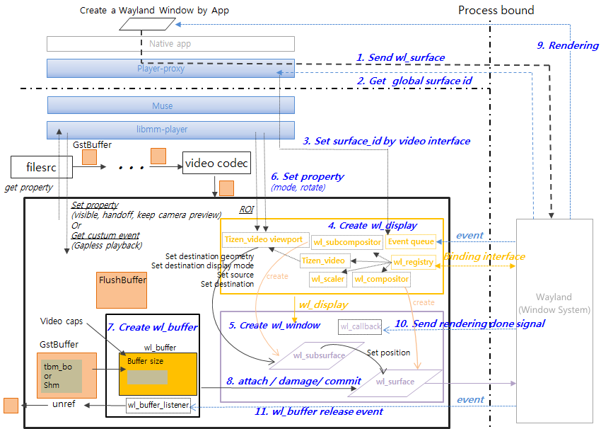

1. Waylandsink requests the rendering of the video frame to the `wl_surface` of a window, so Waylandsink needs the `wl_surface` of a Wayland window created by the application. Because the application and Muse are in different process bounds, the application cannot pass the `wl_surface` pointer to Muse. To solve this problem, Tizen uses the surface ID value.
1. The application sends a `wl_surface` pointer to the Window Server, which returns the global surface ID to the application, which in turn passes this value to Waylandsink using the `GstVideoOverlay` interface, `set_wl_window_wl_surface_id()` (Tizen-specific). **Steps 1, 2, and 3 in the figure.**
1. Waylandsink creates `wl_display` to communicate with the Window Server. Normally a Window client uses the `wl_display` created by the application, but the Tizen Waylandsink creates its own `wl_display` due to process bounds issues. **Step 4.** Now Waylandsink can receive events from the server and bind to various interfaces using `wl_registry`.
1. Waylandsink uses `wl_display` to create `wl_window` and a `wl_subsurface` using the global surface ID passed through the `GstVideoOverlay` interface. `wl_surface` is created by the `wl_compositor` of `wl_display`. **Step 5.**
1. The application can use the Waylandsink properties to change video rendering conditions through `wl_subsurface`. **Step 6.**
1. The `GstBuffer` received from the video codec is converted into a `wl_buffer`, then the `wl_surface` of `wl_window` is requested to render the video frame to the Window Server through the attach, damage, and commit process. **Steps 7 and 8.** The Window Server renders the `wl_buffer`. **Step 9.**
1. When the Window Server finishes rendering the video frame, the rendering complete signal is sent to the `wl_callback` of `wl_window`, and the `wl_buffer` release event is sent to the `wl_buffer_listener` callback function. **Steps 10 and 11.** Now, Waylandsink can unreference the `GstBuffer` created by the video codec and return the `GstBuffer` to the video codec. Sometimes, it is necessary to return a `GstBuffer` while maintaining the rendered video frame in the window (for gapless playback, or keeping a camera preview). In this case, use `FlushBuffer`, which is a `wl_buffer` created after copying TBM from `GstBuffer` coming from the video codec. Waylandsink returns the `GstBuffer` to the video codec immediately, and a request to render the `FlushBuffer` is made to the Window Server.

For more information on Wayland, see [https://wayland.freedesktop.org/](https://wayland.freedesktop.org/).  For more information on programming the Wayland client, see [Programming Wayland Clients](https://jan.newmarch.name/Wayland/index.html).

### Porting the OAL Interface
There is no specific OAL for the videosink.

### Tizen-specific Features Added to Waylandsink

You can check the original waylandsink behavior easily with Waylandsink's video rendering test. Simply connect to videotestsrc through gst-launch. If the video test screen does not appear, the Window system [must be ported first](graphics-and-ui.md#display-management).

```
gst-launch-1.0 videotestsrc ! waylandsink
```
**Figure: Video test screen**


#### Waylandsink Requirements for Tizen

Open source Waylandsink uses `wayland-client`, but Waylandsink for Tizen uses `libtbm`, `wayland-tbm-client`, and `tizen-extension-client` to support MMFW's API requirements and uses Window Server extended functionality.

The major functions are TBM Video Format, Specific Video Formats, Zero copy, MMVideoBuffer, Tizen Viewport, Flush Buffer, Audio only mode, Handoffs Element signals, preroll-handoff Element signals, Use TBM, Rotate, Flip, Visible, Display Geometry Method, and ROI.

**TBM Video Format**

Original Waylandsink lists various video formats, but Wayland only supports the RGB format. To support various video formats, Waylandsink for Tizen uses the TBM Video Format provided by Wayland for Tizen. The video formats supported by the Window Server are hardware-dependent. The dependency is on the Window Server. When the Gst-pipeline with Waylandsink is created and the caps negotiation begins, the TBM video format provided by the Window Server is passed to Waylandsink. The Window Server can accommodate the video output format of the video codec when the negotiation is completed.

To use the TBM Video Format, Waylandsink needs to bind `tizen_policy_interface`, `tizen_video_interface`, and `register listener` and get the video formats as a callback.

```cpp
static void handle_tizen_video_format(void *data, struct tizen_video *tizen_video, uint32_t format) {
    GstWlDisplay *self = data;
    FUNCTION;

    g_return_if_fail(self != NULL);

    GST_LOG("format is %d", format);
    g_array_append_val(self->tbm_formats, format);
}

static const struct tizen_video_listener tizen_video_listener = {
    handle_tizen_video_format
};

static void global_registry_handler(void *data, struct wl_registry *registry, uint32_t id, const char *interface, uint32_t version) {
    [...]
    } else if (g_strcmp0(interface, "tizen_policy") == 0) {
        self->tizen_policy = wl_registry_bind(registry, id, &tizen_policy_interface, 1);
    } else if (g_strcmp0(interface, "tizen_video") == 0) {
        self->tizen_video = wl_registry_bind(registry, id, &tizen_video_interface, version);
        g_return_if_fail(self->tizen_video != NULL);
        tizen_video_add_listener(self->tizen_video, &tizen_video_listener, self);
    }
    [...]
}
```

**Specific Video Formats (SN12, SN21, ST12, SR32, S420) for Zero copy**

The SN12, SN21, ST12, SR32, and S320 formats are identical to NV12, NV21, NV12MT, BGRA, and I420, but the Multimedia framework uses these specific video formats to indicate that the formats are using a TBM buffer. Tizen provides a TBM buffer to avoid memory copying when transferring the buffer to different processes. `Camerasrc` or the video codec writes the video data to the TBM buffer, saves it to a pointer to `GstBuffer`, and sends it to Waylandsink. Waylandsink creates a `wl_buffer` with `tbm_bo` and requests rendering from the Window Server. There is no memory copy from `Camerasrc` or the video codec to the Window Server. This process is called Zero Copy.

**MMVideoBuffer**

The Gst Element must use the MMVideoBuffer type when transferring TBM buffer. tbm bo must be stored in bo of MMVideoBufferHandle, and the type must be MM_VIDEO_BUFFER_TYPE_TBM_BO. Waylandsink makes wl_buffer by using the MMVideoBuffer information. If the video frame is not rendered, Waylandsink must make sure that the information in MMVideoBuffer in GstBuffer received from Camerasrc or Video Codec is correct.

```cpp
typedef struct {
    MMVideoBufferType type; /* Buffer type - the handle field that type indicates must be filled, and other handle fields are optional */
    MMPixelFormatType format; /* Buffer type */
    int plane_num; /* Number of planes */
    int width[MM_VIDEO_BUFFER_PLANE_MAX] /* Width of buffer */
    int height[MM_VIDEO_BUFFER_PLANE_MAX]; /* Height of buffer */
    int stride_width[MM_VIDEO_BUFFER_PLANE_MAX]; /* Stride width of buffer */
    int stride_height[MM_VIDEO_BUFFER_PLANE_MAX]; /* Stride height of buffer */
    int size[MM_VIDEO_BUFFER_PLANE_MAX]; /* Size of planes */
    void *data[MM_VIDEO_BUFFER_PLANE_MAX]; /* Data pointer(user address) of planes */
    int handle_num; /* Number of buffer handle */
    int handle_size[MM_VIDEO_BUFFER_PLANE_MAX]; /* Size of handles */
    MMVideoBufferHandle handle; /* Handle of buffer */
    int is_secured; /* Secured buffer flag, such as TrustZone memory; user cannot access it */
    int flush_request; /* Flush request flag - if this flag is TRUE, sink element makes copy of last buffer, and it returns all buffers from src element. Then, src element can restart without changing pipeline state */
    MMRectType crop; /* Crop information of buffer */
} MMVideoBuffer;
```
MMVideoBuffer can contain video data information of all cases, as shown in the following figure.

**Figure: MMVideoBuffer content**

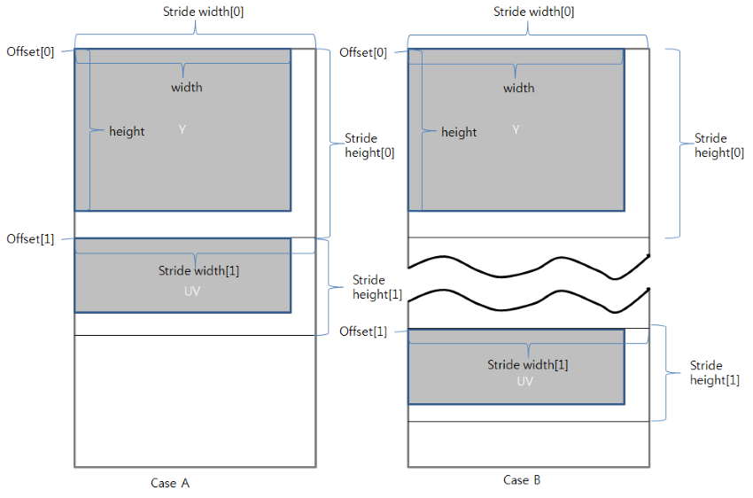


##### Tizen Viewport

To change the video frame render condition, the original open-source Waylandsink uses `wlsurface_set_source()`, `wl_surface_set_buffer_transform()`, `wl_subsurface_set_position()`, `wl_viewport_set_destination()`, and `wl_surface_set_buffer_transform()` functions. For more information on the Wayland API, see [https://wayland.freedesktop.org/docs/html/](https://wayland.freedesktop.org/docs/html/). Waylandsink needs to IPC with `wl_surface`, `wl_subsurface`, and `wl_viewport`.

**Figure: Changing video frame render conditions**

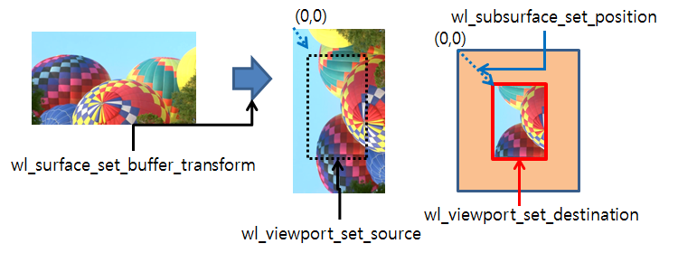

**Figure: Wayland protocols**

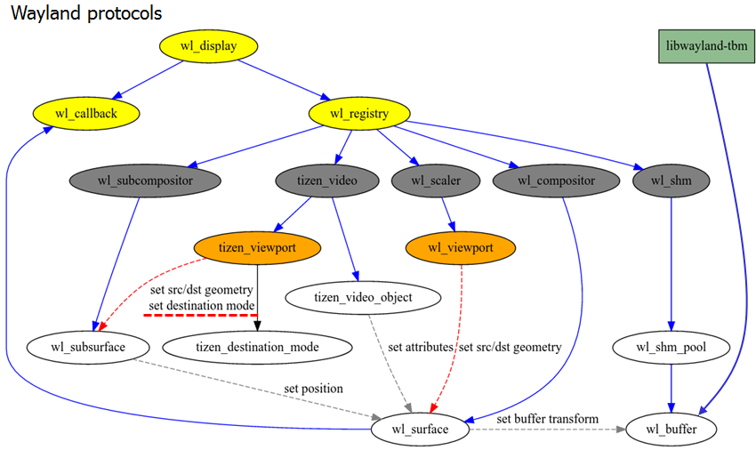

Waylandsink in the Muse Daemon requests rendering conditions on the `wl_subsurface` of the window created by the application. Therefore, it is difficult to match the geometry sync of the parent (Window) and `wl_subsurface`, due to the delay caused by the IPC communication between the Window Server and Wayland client. Since `wl_viewport_` and `wl_set_source_` are surface-based coordination, it is difficult to calculate the coordinates when the buffer is transformed. So Waylandsink for Tizen uses `tizen_viewport supported` Wayland Server for Tizen. To use `tizen_viewport`, Waylandsink binds `tizen_policy_interface` and `tizen_video_interface`. Now, Waylandsink only needs to IPC `tizen_viewport`.

**Figure: Tizen viewport**

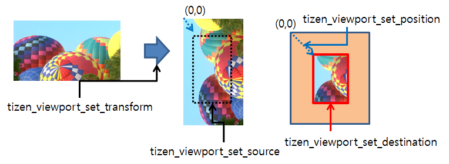

- Example 1:  
  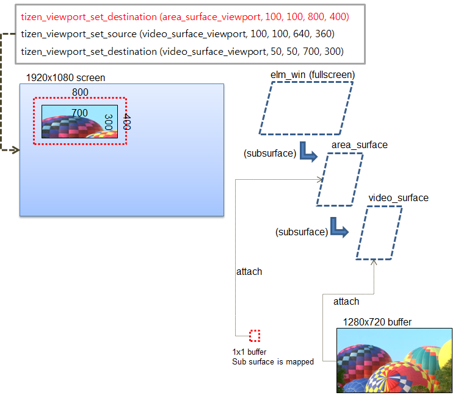
- Example 2:  
  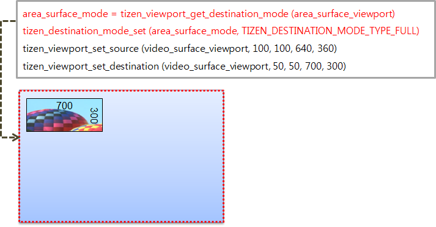
- Example 3:  
  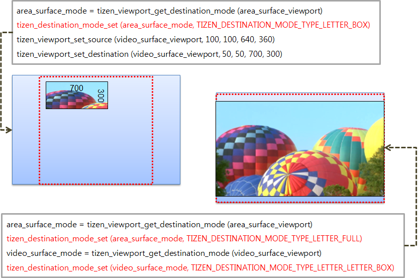
- Example 4:  
  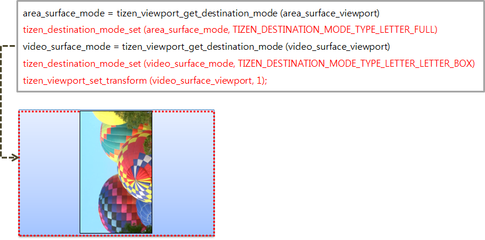


**Flush buffer**

Sometimes, it is necessary to return `GstBuffer` while maintaining the video frame rendered in the window. In this case, use `FlushBuffer`, which is a `wl_buffer` created after copying TBM from `GstBuffer` coming from the video codec or `Camerasrc`. Waylandsink returns the `GstBuffer` to the video codec or `Camerasrc` immediately, and a request to render the `FlushBuffer` is made to the Window Server.

1. Gapless video playback  
   Waylandsink receives the `GST_EVENT_CUSTOM_DOWNSTREAM` event from the player when it performs gapless video playback. The player creates a `FlushBuffer`.
   ```cpp
   #define GST_APP_EVENT_FLUSH_BUFFER_NAME "application/flush-buffer"

   static gboolean gst_wayland_sink_event(GstBaseSink * bsink, GstEvent * event) {
       [...]  
       switch (GST_EVENT_TYPE(event)) {
       case GST_EVENT_CUSTOM_DOWNSTREAM:
           s = gst_event_get_structure(event);
           if (s == NULL || !gst_structure_has_name(s, GST_APP_EVENT_FLUSH_BUFFER_NAME))
               break;
           gst_wayland_sink_render_flush_buffer(bsink);
       [...]
   }
   ```
1. `keep-camera-preview`  
   The camera sets this property when it needs to maintain the last video frame. Waylandsink copies the last TBM buffer and returns it immediately when the state changes (PAUSED_TO_READY).
   ```
   keep-camera-preview : Last tbm buffer is copied and returned to camerasrc immediately when state change(PAUSED_TO_READY)
                         flags: readable, writable
                         Boolean. Default: false
   ```
1. `flush_request` of MMVideoBuffer  
   `Camerasrc` and the video codec can set a flag to request a flushbuffer in the `GstBuffer` using `MMVideoBuffer.flush_request = TRUE`.

**Audio only mode**

Waylandsink has a `disable-overlay` property to support the player's audio-only mode. If this property is set, the video frame is not rendered. When the player needs to show a video frame, it needs to set this property to `false` and set `wl_surface_id`.

```
disable-overlay : Stop using overlay by destroying wl_window and wl_display, Use gst_video_overlay_set_wl_window_wl_surface_id before setting FALSE to use overlay
                              flags: readable, writable
                              Boolean. Default: false
```

```cpp
gst_wayland_sink_set_property(GObject * object, guint prop_id, const GValue * value, GParamSpec * pspec) {
    [...]
    case PROP_DISABLE_OVERLAY:
       sink->disable_overlay = g_value_get_boolean(value);
       if (sink->window && sink->display) {
         if (sink->disable_overlay) {   /* set TRUE */
           g_clear_object(&sink->window);
           g_clear_object(&sink->display);
        } else /* set FALSE */
          gst_wayland_sink_recover_display_window_info(sink);
       }
       break;
    [...]
}

static GstFlowReturn gst_wayland_sink_render(GstBaseSink * bsink, GstBuffer * buffer) {
    [...]
    /* check overlay */
    if (gst_wayland_sink_is_disabled_overlay(sink)) {
        GST_LOG("set disable_overlay, so skip");
        goto done; //skip video rendering
    }
    [...]
}

Refer to mm_player_priv.c
/* Need to set surface_id to enable overlay */
gst_video_overlay_set_wl_window_wl_surface_id(GST_VIDEO_OVERLAY(player->pipeline->videobin[MMPLAYER_V_SINK].gst), *(int*)handle);
```

**Handoffs and preroll-handoff element signals**

Changing the gst-pipeline of the player is labor-intensive, so Waylandsink provides a fakesink functionality. If this property is set to `true`, Waylandsink sends a handoff signal to the player.

```cpp
static GstFlowReturn gst_wayland_sink_render(GstBaseSink * bsink, GstBuffer * buffer) {
    [...]
    /* fakesink function for media stream callback case */
    if (sink->signal_handoffs) {
        GST_LOG("g_signal_emit: hand-off ");
        g_signal_emit(sink, gst_waylandsink_signals[SIGNAL_HANDOFF], 0, buffer, bsink->sinkpad);
        goto done;  /* Skip video rendering */
    }
    [...]
}
```

**Use TBM**

Waylandsink use 2 types of buffers, shared memory and TBM memory. The default value of the `use-tbm` property is `true` and Waylandsink uses TBM memory. If the value is `false`, Waylandsink for Tizen uses shared memory just like the original open-source Waylandsink.
```
use-tbm  : Use Tizen Buffer Memory instead of Shared memory, Memory is allocated by TBM instead of SHM when enabled
           flags: readable, writable
           Boolean. Default: true
```

**Rotate**

Waylandsink can rotate the angle of display output. The default value of the `rotate` property is 0, "DEGREE_0".
```
rotate   : Rotate angle of display output
           flags: readable, writable
           Enum "GstWaylandSinkRotateAngleType" Default: 0, "DEGREE_0"
                (0): DEGREE_0         - No rotate
                (1): DEGREE_90        - Rotate 90 degree
                (2): DEGREE_180       - Rotate 180 degree
                (3): DEGREE_270       - Rotate 270 degree
```

The enumeration values used by the player or camera need to be converted to values used by Wayland.
```cpp
static gint gst_wl_window_find_rotate_transform(guint rotate_angle) {
    gint transform = WL_OUTPUT_TRANSFORM_NORMAL;
    switch (rotate_angle) {
    case DEGREE_0:
         transform = WL_OUTPUT_TRANSFORM_NORMAL;
         break;
    case DEGREE_90:
        transform = WL_OUTPUT_TRANSFORM_90;
        break;
    case DEGREE_180:
        transform = WL_OUTPUT_TRANSFORM_180;
        break;
    case DEGREE_270:
        transform = WL_OUTPUT_TRANSFORM_270;
        break;  
    }

    return transform;
}

transform =  gst_wl_window_find_rotate_transform(window->rotate_angle.value);
tizen_viewport_set_transform(window->tizen_area_viewport, transform);
```

**Flip**

Waylandsink can flip the angle of the display output. The default value of the `flip` property is 0, "FLIP_NONE".
```
 flip  : Flip for display
         flags: readable, writable
         Enum "GstWaylandSinkFlipType" Default: 0, "FLIP_NONE"
              (0): FLIP_NONE        - Flip NONE
              (1): FLIP_HORIZONTAL  - Flip HORIZONTAL
              (2): FLIP_VERTICAL    - Flip VERTICAL
              (3): FLIP_BOTH        - Flip BOTH
```

Wayland has no flip function, so Waylandsink must implement flipping by rotating the video viewport:
```cpp
static gint gst_wl_window_find_flip_transform(guint flip) {
    gint transform = WL_OUTPUT_TRANSFORM_NORMAL;
    FUNCTION;

    GST_DEBUG("flip (%d)", flip);
    switch (flip) {
    case FLIP_NONE:
        transform = WL_OUTPUT_TRANSFORM_NORMAL;
        break;
    case FLIP_HORIZONTAL:
        transform = WL_OUTPUT_TRANSFORM_FLIPPED;
        break;
    case FLIP_VERTICAL:
        transform = WL_OUTPUT_TRANSFORM_FLIPPED_180;
        break;
    case FLIP_BOTH:
        transform = WL_OUTPUT_TRANSFORM_180;
        break;
    }

    return transform;
}

transform = gst_wl_window_find_flip_transform(window->flip.value);
tizen_viewport_set_transform(window->tizen_video_viewport, transform);
```

**Visible**

Waylandsink can make the video frame visible or invisible on the display. To make the video frame invisible, attach `NULL`. To make the video fame visible, Waylandsink needs to keep the last rendered video frame.

```cpp
/* invisible */
static void gst_wayland_sink_stop_video(GstWaylandSink * sink) {
    FUNCTION;
    g_return_if_fail(sink != NULL);
    gst_wl_window_render(sink->window, NULL, NULL);
}
/* visible */
gst_wayland_sink_update_last_buffer_geometry(sink);
```

**Display geometry method and ROI**

When rendering video, Waylandsink can change the geometry.

```
display-geometry-method: Geometrical method for display
           flags: readable, writable
           Enum "GstWaylandSinkDisplayGeometryMethodType" Default: 0, "LETTER_BOX"
                (0): LETTER_BOX       - Letter box
                (1): ORIGIN_SIZE      - Origin size
                (2): FULL_SCREEN      - Full-screen
                (3): CROPPED_FULL_SCREEN - Cropped full-screen
                (4): ORIGIN_SIZE_OR_LETTER_BOX - Origin size(if screen size is larger than video size(width/height)) or Letter box(if video size(width/height) is larger than screen size)
                (5): DISP_GEO_METHOD_CUSTOM_ROI - Specially described destination ROI
```
These are provided by using `tizen_viewport` since Tizen 3.0.

```cpp
enum {
    DISP_GEO_METHOD_LETTER_BOX = 0,
    DISP_GEO_METHOD_ORIGIN_SIZE,
    DISP_GEO_METHOD_FULL_SCREEN,
    DISP_GEO_METHOD_CROPPED_FULL_SCREEN,
    DISP_GEO_METHOD_ORIGIN_SIZE_OR_LETTER_BOX,
    DISP_GEO_METHOD_CUSTOM_ROI,
    DISP_GEO_METHOD_NUM,
};

if (tizen_disp_mode > -1) {
    tizen_destination_mode_set(window->tizen_video_dest_mode, tizen_disp_mode);
}
```

ROI coordinates can be set only when the value of `display-geometry-method` is set to 5, and ROI coordinates are obtained from `gst_video_overlay_set_render_rectangle()` from the player or camera.
```cpp
if (window->disp_geo_method.value == DISP_GEO_METHOD_CUSTOM_ROI) {
    tizen_viewport_set_destination(window->tizen_video_viewport, window->roi.x, window->roi.y, window->roi.w, window->roi.h);
}
```

The following examples describe the various available modes:

- Letterbox mode  
Fit the video source to the width or height of the window, aligned to the center and keeping the aspect ratio of the original video source.
  - Window (width/height) > Video source (width/height)  

    

  - Window (width/height) < Video source (width/height)  

    
- Original size mode  
Set the video source size the same as the original video size, aligned to the center and keeping the aspect ratio of the original video source.
  - Window size > Video source size

      
  - Window size < Video source size

    
- Cropped full screen mode  
Fit the video source to the width and height, cropping out the area outside the window, aligned to the center and keeping the aspect ratio of the original video source.
  - Window (width/height) > Video source (width/height)

    
  - Window (width/height) < Video source (width/height)  

    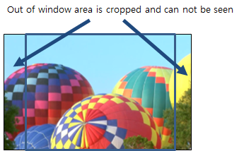
- ROI mode  
The user sets the location and size of where the video is rendered.
  - Window size: width(1920), height(1080), ROI size: x(100), y(100), width(800), height(400)

    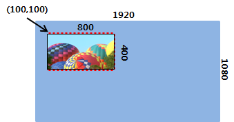
